<h1 style="text-align: center;">Invoice App</h1>

### Table of Contents

- [Introduction](#introduction)
  - [Project Overview](#project-overview)
  - [Technology Stack](#technology-stack)
- [Architecture Overview](#architecture-overview)
  - [Design Decisions](#design-decisions)
- [Database Schema](#database-schema)
  - [Entity-Relationship Diagram (ERD)](#entity-relationship-diagram-erd)
  - [Table Descriptions](#table-descriptions)
  - [Relationships](#relationships)
- [Feature Descriptions](#feature-descriptions)
  - [Feature Name: Sign Up User](#feature-name-sign-up-user)
  - [Feature Name: Login User](#feature-name-login-user)
  - [Feature Name: Initiate Reset Password for All Users](#feature-name-initiate-reset-password-for-all-users)
  - [Feature Name: Confirm Reset Password for All Users](#feature-name-confirm-reset-password-for-all-users)
  - [Feature Name: Confirm Email](#feature-name-confirm-email)
  - [Feature Name: Refresh Token](#feature-name-refresh-token)
  - [Feature Name: Update Profile](#feature-name-update-profile)
  - [Feature Name: Submit Feedback](#feature-name-submit-feedback)
  - [Feature Name: Retrieves all feedback. Admin only.](#feature-name-retrieves-all-feedback-admin-only)
  - [Feature Name: Updates feedback status. Admin only.](#feature-name-updates-feedback-status-admin-only)
  - [Feature Name: Responds to feedback. Admin only.](#feature-name-responds-to-feedback-admin-only)
  - [Feature Name: Create Invoice](#feature-name-create-invoice)
  - [Feature Name: Get Invoice by Invoice id](#feature-name-get-invoice-by-invoice-id)
  - [Feature Name: Get All Invoice for a User](#feature-name-get-all-invoice-for-a-user)
  - [Feature Name: Get All Invoices for a User](#feature-name-get-all-invoices-for-a-user)
  - [Feature Name: Get All Invoices for a User with Pagination](#feature-name-get-all-invoices-for-a-user-with-pagination)
  - [Feature Name: Edit Invoice](#feature-name-edit-invoice)
  - [Feature Name: Delete Invoice by ID](#feature-name-delete-invoice-by-id)
  - [Feature Name: Mark an Invoice as Paid](#feature-name-mark-an-invoice-as-paid)
  - [Feature Name: Mark an Invoice as Pending](#feature-name-mark-an-invoice-as-pending)
  - [Feature Name: Generate Recurring Invoices](#feature-name-generate-recurring-invoices)
  - [Feature Name: Create Swagger Credentials](#feature-name-create-swagger-credentials)
  - [Feature Name: View User Details](#feature-name-view-user-details)
  - [Feature Name: Update User Details](#feature-name-update-user-details)
  - [Feature Name: Deactivate User Account](#feature-name-deactivate-user-account)
  - [Feature Name: Delete User Account](#feature-name-delete-user-account)
  - [Feature Name: Activate User Account](#feature-name-activate-user-account)
  - [Feature Name: Hard Delete User Account](#feature-name-hard-delete-user-account)
- [Setup and Installation](#setup-and-installation)
  - [Local Setup](#local-setup)
  - [Environment Variables](#environment-variables)

## Introduction

### Project Overview

InvoiceApp is a streamlined invoice management system designed to assist small business owners who provide services. It enables businesses to effortlessly track their operations, offering insights into customer purchasing patterns and identifying frequent customers. The system also supports the automation of recurring invoices, helping businesses maintain strong customer relationships and improve operational efficiency.

### Technology Stack

InvoiceApp utilizes a client-server architecture:

- **Frontend**: The user interface is built with **TypeScript** and **Next.js**, providing a modern and responsive experience. **Axios** is used for HTTP requests, while **Redux Toolkit** manages the application's state efficiently.

- **Backend**: The backend is developed using **C#** with **ASP.NET Core** to create robust and scalable endpoints. The application leverages various **Azure Cloud Services**, including:
  - **Azure Storage Account** for data storage
  - **Azure Functions** for serverless computing tasks
  - **Microsoft SQL Database** for relational data management
  - **Key Vault** for secure management of application secrets
  - **App Service** for hosting the application
  - **Application Insights** for monitoring and diagnostics

## Architecture Overview

The following diagram provides a high-level view of the **InvoiceApp** architecture, illustrating the key components and their interactions within the system. This diagram is designed to give you a clear understanding of how the application is structured, how data flows between components, and how various services are integrated to achieve the application's functionality.

- **User Interaction**: Users interact with the system through the frontend, which communicates with the backend API server.
- **Authentication and Authorization**: User authentication is managed using JWT tokens, with Role-Based Access Control (RBAC) ensuring users have appropriate access levels.
- **Swagger Documentation Security**: To secure the API documentation, Swagger is protected with credentials that are generated dynamically and expire after 24 hours.
- **Storage**: User profile pictures are securely stored in Azure Blob Storage, a highly scalable and durable storage solution.
- **Serverless Functions**: The system incorporates Azure Functions for handling specific tasks like PDF generation and recurring invoices, allowing for scalability and cost efficiency.
- **Data Management**: All user data is stored securely in a Microsoft SQL Server database, ensuring data integrity and reliability.
- **Monitoring and Diagnostics**: The application’s performance, health, and usage are continuously monitored using Azure Application Insights, providing real-time analytics and insights into the system's behavior.

Below is the architectural diagram that visually represents these components and their relationships:

<div style="text-align: center;">
  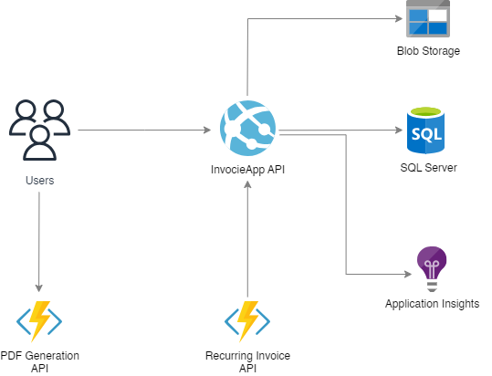
</div>

### Design Decisions

1. **Cost Efficiency**:

   - One of the primary considerations was cost. Leveraging **Azure Functions** for certain features allows you to scale the application efficiently without incurring high costs for unused resources, as you're only billed for execution time.

2. **Scalable Serverless Architecture**:

   - The decision to decouple features such as **PDF generation** and **Recurring Invoice** to Azure Functions was driven by the need for a scalable and flexible architecture. This approach ensures that these processes can run independently without affecting the performance of the main application. It’s the right way to go for scalability and cost-effectiveness.

3. **Azure Blob Storage for Profile Pictures**:

   - Storing user profile pictures in **Azure Blob Storage** was chosen for its high availability, durability, and scalability. Azure Blob Storage is optimized for large amounts of unstructured data, making it ideal for storing images and other media files.

4. **JWT for Authentication and Authorization**:

   - JWT (JSON Web Tokens) was selected for its simplicity and stateless nature, which fits well with the need for secure and scalable authentication.

5. **Securing Swagger Documentation**:

   - Protecting the Swagger documentation with auto-generated credentials ensures that only authorized users can access the API documentation. This adds a layer of security, preventing unauthorized access to API details.

6. **External API for Swagger Authentication**:

   - Using an external API (Pokemon API) to generate usernames adds a unique and dynamic approach to generating credentials, which enhances security. The decision to delete these credentials after 24 hours was made to reduce the risk of unauthorized access.

7. **Infrastructure Provisioning**:

   - Provisioning resources through Azure ensures that you leverage the cloud's flexibility and scalability. Using Azure's suite of tools, you can dynamically allocate resources based on current needs, further optimizing costs.

8. **RBAC Implementation**:
   - Role-Based Access Control (RBAC) was implemented to ensure that users have appropriate access levels based on their roles. This enhances security and ensures that users only interact with parts of the application they are authorized to use.

## Database Schema

### Entity-Relationship Diagram (ERD)

Below is the Entity-Relationship Diagram (ERD) representing the key entities and relationships in the **InvoiceApp** system. The diagram illustrates how the various entities are connected, highlighting primary keys, foreign keys, and cardinality.

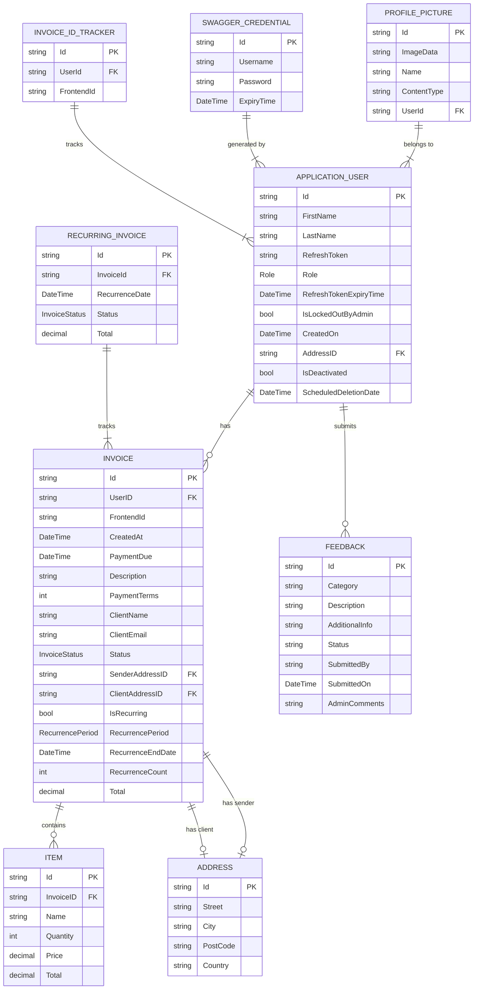
```mermaid
erDiagram
    APPLICATION_USER {
        string Id PK
        string FirstName
        string LastName
        string RefreshToken
        Role Role
        DateTime RefreshTokenExpiryTime
        bool IsLockedOutByAdmin
        DateTime CreatedOn
        string AddressID FK
        bool IsDeactivated
        DateTime ScheduledDeletionDate
    }

    ADDRESS {
        string Id PK
        string Street
        string City
        string PostCode
        string Country
    }

    PROFILE_PICTURE {
        string Id PK
        string ImageData
        string Name
        string ContentType
        string UserId FK
    }

    INVOICE {
        string Id PK
        string UserID FK
        string FrontendId
        DateTime CreatedAt
        DateTime PaymentDue
        string Description
        int PaymentTerms
        string ClientName
        string ClientEmail
        InvoiceStatus Status
        string SenderAddressID FK
        string ClientAddressID FK
        bool IsRecurring
        RecurrencePeriod RecurrencePeriod
        DateTime RecurrenceEndDate
        int RecurrenceCount
        decimal Total
    }

    ITEM {
        string Id PK
        string InvoiceID FK
        string Name
        int Quantity
        decimal Price
        decimal Total
    }

    FEEDBACK {
        string Id PK
        string Category
        string Description
        string AdditionalInfo
        string Status
        string SubmittedBy
        DateTime SubmittedOn
        string AdminComments
    }

    RECURRING_INVOICE {
        string Id PK
        string InvoiceId FK
        DateTime RecurrenceDate
        InvoiceStatus Status
        decimal Total
    }

    INVOICE_ID_TRACKER {
        string Id PK
        string UserId FK
        string FrontendId
    }

    SWAGGER_CREDENTIAL {
        string Id PK
        string Username
        string Password
        DateTime ExpiryTime
    }

    APPLICATION_USER ||--o{ INVOICE : "has"
    INVOICE ||--o{ ITEM : "contains"
    INVOICE ||--o| ADDRESS : "has sender"
    INVOICE ||--o| ADDRESS : "has client"
    APPLICATION_USER ||--o{ FEEDBACK : "submits"
    RECURRING_INVOICE ||--|{ INVOICE : "tracks"
    PROFILE_PICTURE ||--|{ APPLICATION_USER : "belongs to"
    SWAGGER_CREDENTIAL ||--|{ APPLICATION_USER : "generated by"
    INVOICE_ID_TRACKER ||--|{ APPLICATION_USER : "tracks"
```

### Table Descriptions

- **Address**: Stores the address details, which are used for both the sender and the client in an invoice. Each `Invoice` can have a sender and client address.

- **ApplicationUser**: Represents the users of the system. This table inherits from `IdentityUser`, providing authentication capabilities. It includes fields for user information such as `FirstName`, `LastName`, `Role`, and `AddressID`, along with references to other entities like `Invoices`, `ProfilePicture`, and user-related flags.

- **ProfilePicture**: Stores the profile pictures of the users. This table includes fields for storing the image data, name, and content type, along with a foreign key (`UserId`) to the `ApplicationUser`.

- **Invoice**: Contains invoice details like `UserID`, `PaymentDue`, `Description`, `Status`, and `Total`. Each invoice is linked to a user, and it can also reference addresses for the sender and client. Invoices can be recurring, with recurrence settings stored in the same entity.

- **Item**: Represents individual items in an invoice. Each item belongs to an invoice and includes fields for the item name, quantity, price, and total.

- **Feedback**: Stores feedback provided by users. Fields include `Category`, `Description`, `Status`, and `SubmittedBy`. This table helps capture user experiences and additional information for admin review.

- **RecurringInvoice**: Tracks invoices that are set to recur. It is linked to an `Invoice` and includes details such as `RecurrenceDate`, `Status`, and `Total`.

- **InvoiceIdTracker**: Tracks the frontend ID associated with a user, helping to ensure uniqueness and mapping between user-related invoices.

- **SwaggerCredential**: Stores the dynamically generated credentials used to secure the Swagger documentation. These credentials have a limited lifespan, as indicated by the `ExpiryTime`.

### Relationships

- **ApplicationUser and Invoice**: One user can have many invoices, but each invoice is associated with a single user.
- **Invoice and Item**: Each invoice can contain multiple items, representing the goods or services provided.

- **ApplicationUser and ProfilePicture**: Each user can have a single profile picture.

- **Invoice and Address**: Each invoice is associated with two addresses, one for the sender and one for the client, both of which are stored in the `Address` table.

- **RecurringInvoice and Invoice**: Tracks recurring invoices, associating each recurring instance with its original invoice.

- **ApplicationUser and Feedback**: Users can submit feedback, which is tracked in the `Feedback` table.

- **SwaggerCredential and ApplicationUser**: Swagger credentials are generated and associated with users for API documentation access.

---

## Feature Descriptions

### Feature Name: Sign Up User

#### Feature Overview

The **Sign Up User** feature allows new users to register an account on the Invoice App. This feature collects essential user information such as first name, last name, email, username, and password. Upon successful registration, the user is assigned a role (defaulting to "User"), and their account details are securely stored in the application’s database. An email confirmation process is also initiated to verify the user's email address.

#### User Stories

- **As a new user**, I want to register for an account using my email, username, and password so that I can access the Invoice App.
- **As an administrator**, I want to ensure that only verified users can access the system, so I require users to confirm their email address after registration.
- **As a developer**, I need a robust and secure registration process that ensures data integrity and user role assignment.

#### Flow Diagram

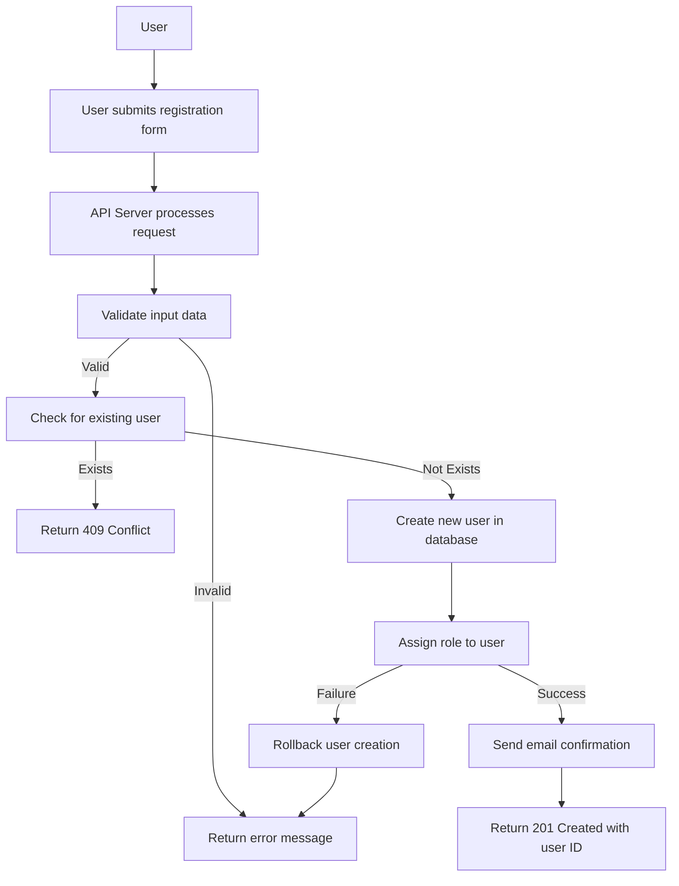
```mermaid
graph TD;
    User-->Registration_Form[User submits registration form];
    Registration_Form-->API_Server[API Server processes request];
    API_Server-->Validate_Input[Validate input data];
    Validate_Input-->|Invalid|Return_Error[Return validation error];
    Validate_Input-->|Valid|Check_Duplicate[Check for existing user];
    Check_Duplicate-->|Exists|Return_Conflict[Return 409 Conflict];
    Check_Duplicate-->|Not Exists|Create_User[Create new user in database];
    Create_User-->Assign_Role[Assign role to user];
    Assign_Role-->|Success|Send_Email[Send email confirmation];
    Send_Email-->Return_Success[Return 201 Created with user ID];
    Assign_Role-->|Failure|Rollback[Rollback user creation];
    Rollback-->Return_Error[Return error message];
```

- **Explanation**:
  - The user submits their registration details.
  - The server validates the input and checks if a user with the same email or username already exists.
  - If valid and unique, the user is created in the database, assigned a role, and an email confirmation is sent.
  - If role assignment fails, a rollback is performed to maintain data integrity.

#### Decision Log

- **Input Validation**: Input validation is enforced on the server side to ensure that all required fields are properly filled and meet the specified criteria.
- **Role Assignment**: Upon registration, users are automatically assigned the "User" role. The system allows for future enhancements where different roles can be assigned based on user needs.
- **Email Confirmation**: To prevent unauthorized access and ensure valid email addresses, a confirmation email is sent to the user after registration. The email contains a link to verify the user's email address.
- **Rollback on Failure**: If an error occurs during role assignment, the system will delete the newly created user to prevent orphaned records and ensure data consistency.

#### Endpoints and API Documentation

#### Endpoint Description

This endpoint handles the registration of new users. It validates the input, creates the user in the database, assigns a role, and initiates an email confirmation process.

#### URL

`POST /api/v{version}/Auth/register`

#### HTTP Method

`POST`

#### Request Headers

- **Content-Type**: `application/json`

#### Request Body

```json
{
	"firstName": "John",
	"lastName": "Doe",
	"email": "john.doe@example.com",
	"username": "johndoe",
	"password": "securepassword123"
}
```

- **firstName**: The user's first name (required, max 50 characters).
- **lastName**: The user's last name (required, max 50 characters).
- **email**: The user's email address (required, valid email format).
- **username**: The username for the user (required, 3-50 characters).
- **password**: The user's password (required, min 6 characters).

#### Response

- **Success (201 Created)**

```json
{
	"isSuccess": true,
	"message": "User Registration was Successful.",
	"result": "user-id-12345"
}
```

- **isSuccess**: Indicates whether the registration was successful.
- **message**: A message confirming successful registration.
- **result**: The unique ID of the newly registered user.

- **Error (409 Conflict)**

```json
{
	"isSuccess": false,
	"message": "A user with this email or username already exists.",
	"result": null
}
```

- **isSuccess**: Indicates that the registration failed due to a conflict.
- **message**: An error message explaining the reason for the failure.

- **Error (400 Bad Request)**

```json
{
	"isSuccess": false,
	"message": "Validation errors occurred.",
	"result": null
}
```

- **isSuccess**: Indicates that the registration failed due to validation errors.
- **message**: A message indicating that there were validation errors.

#### Roles and Permissions

- **Public Access**: This endpoint is publicly accessible as it is required for user registration.
- **Rate Limiting**: To prevent abuse, rate limiting may be applied to this endpoint.

---

### Feature Name: Login User

#### Feature Overview

The **Login User** feature allows users to authenticate themselves and gain access to the Invoice App. This feature verifies user credentials and generates a JSON Web Token (JWT) along with a refresh token for session management. The JWT is used for authenticating subsequent requests, ensuring secure and stateless interactions with the backend. The system also handles various scenarios such as deactivated accounts, email confirmation, and account lockouts, providing appropriate feedback to the user.

#### User Stories

- **As a registered user**, I want to log in using my email and password so that I can access my personal dashboard and manage my invoices.
- **As an administrator**, I want to ensure that only users with confirmed email addresses can log in, to prevent unauthorized access.
- **As a developer**, I need a robust and secure login system that supports JWT-based authentication and handles edge cases like account lockout and deactivation.

#### Flow Diagram

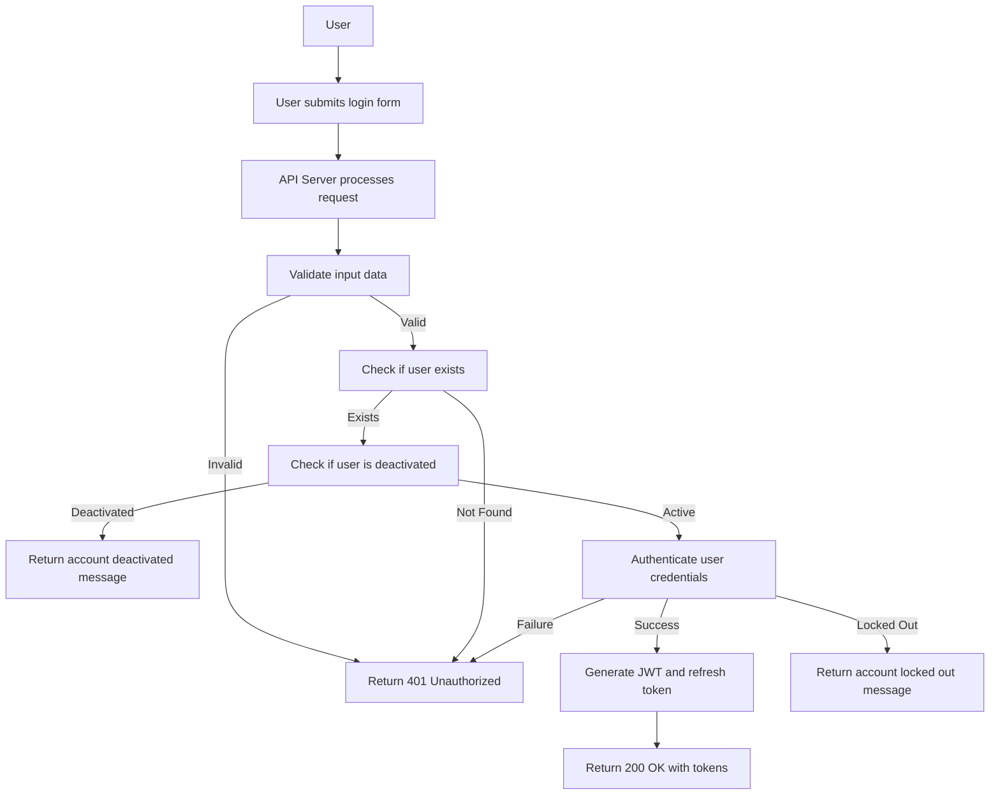
```mermaid
graph TD;
    User-->Login_Form[User submits login form];
    Login_Form-->API_Server[API Server processes request];
    API_Server-->Validate_Input[Validate input data];
    Validate_Input-->|Invalid|Return_Error[Return validation error];
    Validate_Input-->|Valid|Check_User[Check if user exists];
    Check_User-->|Not Found|Return_Error[Return 401 Unauthorized];
    Check_User-->|Exists|Check_Deactivation[Check if user is deactivated];
    Check_Deactivation-->|Deactivated|Return_Deactivated[Return account deactivated message];
    Check_Deactivation-->|Active|Authenticate_User[Authenticate user credentials];
    Authenticate_User-->|Success|Generate_Tokens[Generate JWT and refresh token];
    Generate_Tokens-->Return_Success[Return 200 OK with tokens];

    Authenticate_User-->|Locked Out|Return_Locked_Out[Return account locked out message];
    Authenticate_User-->|Failure|Return_Error[Return 401 Unauthorized];
```

  <!-- Authenticate_User->|Email Not Confirmed|Return_Email_Not_Confirmed[Return email not confirmed message]; -->

- **Explanation**:
  - The user submits their login credentials.
  - The server validates the input, checks if the user exists, and verifies whether the account is active, confirmed, and not locked out.
  - If the credentials are correct and the account is in good standing, the server generates and returns a JWT and a refresh token.
  - If there are any issues (e.g., account not confirmed, locked out), the appropriate error message is returned.

#### Decision Log

- **JWT for Authentication**: The decision to use JWT for authentication allows for a stateless, scalable approach to managing user sessions.
- **Handling Deactivated Accounts**: Accounts that have been deactivated are prevented from logging in, ensuring that only active users can access the system.
- **Email Confirmation**: Users are required to confirm their email addresses before being allowed to log in, enhancing security and ensuring that all users have valid email addresses.
- **Account Lockout**: To protect against brute force attacks, accounts can be locked out after a specified number of failed login attempts, requiring administrative action to unlock.

#### Endpoints and API Documentation

#### Endpoint Description

This endpoint handles user authentication by verifying the provided credentials and returning a JWT and refresh token upon successful login.

#### URL

`POST /api/v{version}/Auth/login`

#### HTTP Method

`POST`

#### Request Headers

- **Content-Type**: `application/json`

#### Request Body

```json
{
	"email": "user@example.com",
	"password": "securepassword123"
}
```

- **email**: The user's email address (required).
- **password**: The user's password (required).

#### Response

- **Success (200 OK)**

```json
{
	"isSuccess": true,
	"message": "Login Successful",
	"result": {
		"user": {
			"id": "user-id-12345",
			"email": "user@example.com",
			"firstName": "John",
			"lastName": "Doe",
			"userName": "johndoe",
			"profilePicture": null,
			"address": null
		},
		"accessToken": "eyJhbGciOiJIUzI1NiIsInR5cCI6IkpXVCJ9...",
		"refreshToken": "A0b1C2d3E4f5G6h7I8j9...",
		"role": ["User"]
	}
}
```

- **isSuccess**: Indicates whether the login was successful.
- **message**: A message confirming successful login.
- **result**: Contains the user's details, access token, refresh token, and assigned roles.

- **Error (401 Unauthorized)**

```json
{
	"isSuccess": false,
	"message": "Invalid Login Attempt.",
	"result": null
}
```

- **isSuccess**: Indicates that the login was unsuccessful.
- **message**: An error message indicating that the credentials provided were incorrect or the account has issues (e.g., not confirmed, locked out).

#### Roles and Permissions

- **Public Access**: This endpoint is publicly accessible as it is required for user authentication.
- **Rate Limiting**: To prevent brute force attacks, rate limiting may be applied to this endpoint.

---

### Feature Name: Initiate Reset Password for All Users

#### Feature Overview

The **Initiate Reset Password** feature allows users to request a password reset by providing their registered email address. Upon receiving the request, the system checks if the email is associated with an existing account. If the account exists and is not locked out by an administrator, a password reset token is generated. This token is then used to create a password reset URL, which can be sent to the user via email. This feature enhances security by ensuring that only users with a valid email associated with an active account can reset their passwords.

#### User Stories

- **As a user**, I want to be able to request a password reset if I forget my password, so that I can regain access to my account.
- **As a user**, I want to be informed whether my password reset request was processed, even if the email provided is not registered, to maintain security and prevent information disclosure.
- **As an administrator**, I want to ensure that users whose accounts are locked out cannot initiate a password reset, to prevent unauthorized access.

#### Flow Diagram

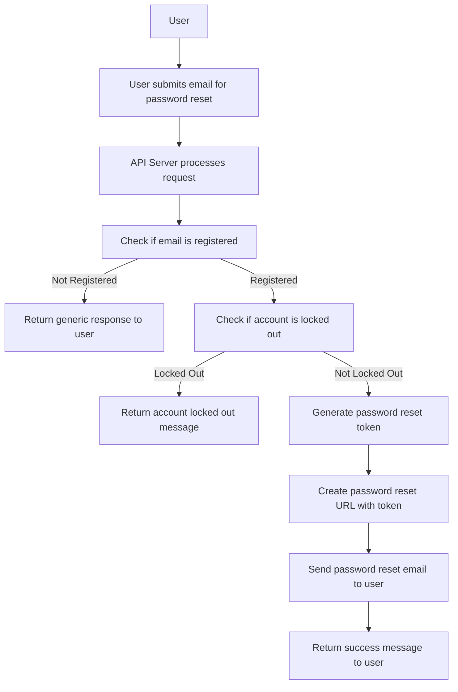
```mermaid
graph TD;
    User-->Submit_Email[User submits email for password reset];
    Submit_Email-->API_Server[API Server processes request];
    API_Server-->Check_Email[Check if email is registered];
    Check_Email-->|Not Registered|Return_Generic_Response[Return generic response to user];
    Check_Email-->|Registered|Check_Lockout[Check if account is locked out];
    Check_Lockout-->|Locked Out|Return_Lockout_Message[Return account locked out message];
    Check_Lockout-->|Not Locked Out|Generate_Token[Generate password reset token];
    Generate_Token-->Create_Reset_URL[Create password reset URL with token];
    Create_Reset_URL-->Send_Email[Send password reset email to user];
    Send_Email-->Return_Success_Message[Return success message to user];
```

- **Explanation**:
  - The user submits their email address to request a password reset.
  - The server checks if the email is registered and whether the account is locked out.
  - If the account is not locked out and the email is registered, a password reset token is generated and sent to the user's email.
  - A generic response is returned to the user regardless of whether the email is registered, ensuring that no information is leaked about the existence of an account.

#### Decision Log

- **Generic Response for Security**: The decision to always return a generic response, regardless of whether the email is registered, was made to prevent attackers from determining if an email is associated with an account.
- **Lockout Check**: The system checks if the user’s account is locked out by an administrator before allowing the reset process. This ensures that deactivated users cannot reset their passwords without administrative approval.
- **Token-Based Reset**: A token-based reset mechanism was chosen to ensure secure, time-limited password resets that require the user to have access to their registered email.

#### Endpoints and API Documentation

#### Endpoint Description

This endpoint initiates the password reset process by accepting a user's email and, if the email is registered and the account is active, generating a password reset token. The token can then be sent to the user's email as part of a password reset URL.

#### URL

`POST /api/v{version}/Auth/initiate-reset-password`

#### HTTP Method

`POST`

#### Request Headers

- **Content-Type**: `application/json`

#### Request Body

```json
{
	"email": "user@example.com"
}
```

- **email**: The user's registered email address (required, valid email format).

#### Response

- **Success (200 OK)**

```json
{
	"isSuccess": true,
	"message": "A notification will be sent to this email if an account is registered under it.",
	"result": null
}
```

- **isSuccess**: Indicates whether the request was successfully processed.
- **message**: A generic message indicating that if the email is registered, further instructions will be sent.
- **result**: This field is typically null for this response.

- **Error (400 Bad Request)**

```json
{
	"isSuccess": false,
	"message": "Validation errors occurred.",
	"result": null
}
```

- **isSuccess**: Indicates that the request failed due to validation errors.
- **message**: A message indicating that there were validation errors.

- **Lockout (403 Forbidden)**

```json
{
	"isSuccess": false,
	"message": "Your account has been deactivated. Please contact admin.",
	"result": null
}
```

- **isSuccess**: Indicates that the request failed because the account is locked out by an administrator.
- **message**: A message indicating that the user needs to contact the admin for reactivation.

#### Roles and Permissions

- **Public Access**: This endpoint is publicly accessible as it is required for initiating the password reset process.
- **Rate Limiting**: To prevent abuse, rate limiting may be applied to this endpoint.

---

### Feature Name: Confirm Reset Password for All Users

#### Feature Overview

The **Confirm Reset Password** feature allows users to finalize the password reset process after they have initiated it and received a reset token. This feature verifies the token provided by the user, validates the new password, and updates the user’s password in the system. Upon successful completion, the user can use the new password to log in. This process ensures that only users with valid tokens can reset their passwords, enhancing the security of the password management process.

#### User Stories

- **As a user**, I want to reset my password using a token that I received via email, so that I can regain access to my account securely.
- **As an administrator**, I want to ensure that only valid password reset requests are processed, so that unauthorized password changes are prevented.
- **As a developer**, I need a secure and reliable mechanism for handling password resets, ensuring that the process is both user-friendly and resistant to attacks.

#### Flow Diagram

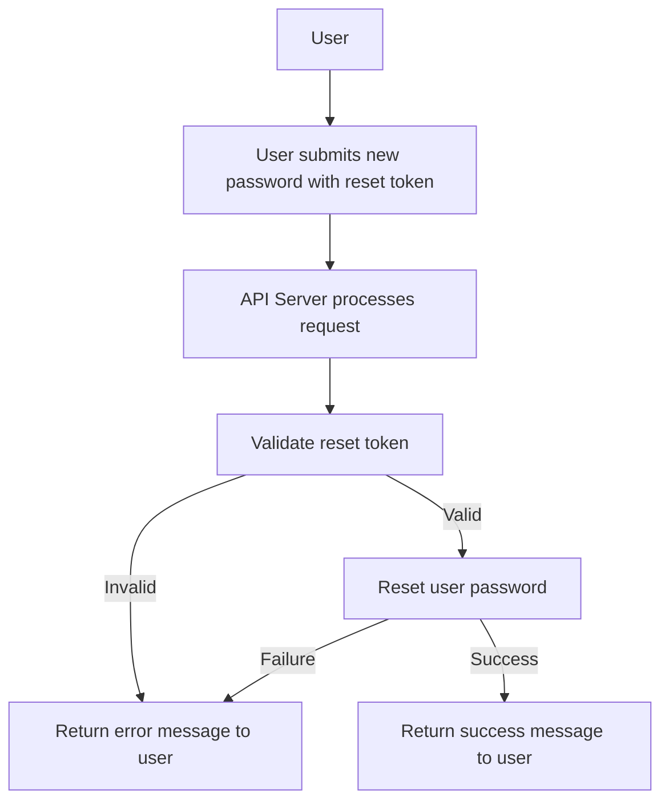
```mermaid
graph TD;
    User-->Submit_New_Password[User submits new password with reset token];
    Submit_New_Password-->API_Server[API Server processes request];
    API_Server-->Validate_Token[Validate reset token];
    Validate_Token-->|Invalid|Return_Error[Return invalid token error];
    Validate_Token-->|Valid|Reset_Password[Reset user password];
    Reset_Password-->|Success|Return_Success[Return success message to user];
    Reset_Password-->|Failure|Return_Error[Return error message to user];
```

- **Explanation**:
  - The user submits their new password along with the reset token and username.
  - The server validates the reset token and ensures that the username is correct.
  - If the token is valid and the password meets the required criteria, the password is reset, and the user is notified of the success.
  - If the token is invalid or the password reset fails, an appropriate error message is returned.

#### Decision Log

- **Token Validation**: The system validates the reset token to ensure that only users who have received a valid token can reset their passwords.
- **Password Security**: Passwords are reset using secure methods provided by the identity management system, ensuring that new passwords are stored securely.
- **Error Handling**: The system provides detailed error messages in case of failure, helping users understand what went wrong and how to proceed.

#### Endpoints and API Documentation

#### Endpoint Description

This endpoint processes password reset confirmations by validating the provided reset token and updating the user's password if the token is valid.

#### URL

`POST /api/v{version}/Auth/confirm-reset-password`

#### HTTP Method

`POST`

#### Request Headers

- **Content-Type**: `application/json`

#### Request Body

```json
{
	"password": "newSecurePassword123",
	"userName": "johndoe",
	"token": "eyJhbGciOiJIUzI1NiIsInR5cCI6IkpXVCJ9..."
}
```

- **password**: The new password that the user wants to set (required).
- **userName**: The username of the account for which the password reset is being confirmed (required).
- **token**: The password reset token that was sent to the user's email (required).

#### Response

- **Success (200 OK)**

```json
{
	"isSuccess": true,
	"message": "Your password has been reset. Please sign in.",
	"result": null
}
```

- **isSuccess**: Indicates whether the password reset was successful.
- **message**: A message confirming that the password has been reset.
- **result**: This field is typically null for this response.

- **Error (400 Bad Request)**

```json
{
	"isSuccess": false,
	"message": "Invalid Password Reset Request",
	"result": null
}
```

- **isSuccess**: Indicates that the password reset request failed.
- **message**: A message explaining why the password reset request was invalid (e.g., invalid token, unregistered username).

#### Roles and Permissions

- **Public Access**: This endpoint is publicly accessible as it is required for confirming password resets.
- **Rate Limiting**: To prevent abuse, rate limiting may be applied to this endpoint.

---

### Feature Name: Confirm Email

#### Feature Overview

The **Confirm Email** feature is designed to validate and activate a user's email address after they have registered for an account or when required by the system. This process is crucial for ensuring that the email address associated with an account is valid and that the user has access to it. The feature requires users to submit a token, which they receive via email, along with their username. Upon successful confirmation, the user's email address is marked as verified, allowing them full access to the platform's features.

#### User Stories

- **As a new user**, I want to confirm my email address so that I can activate my account and use the application.
- **As an administrator**, I want to ensure that all user accounts have verified email addresses, so I can communicate securely and reliably with all users.
- **As a security officer**, I need to ensure that only users with access to a valid email address can confirm their accounts, thus preventing unauthorized account access.

#### Flow Diagram

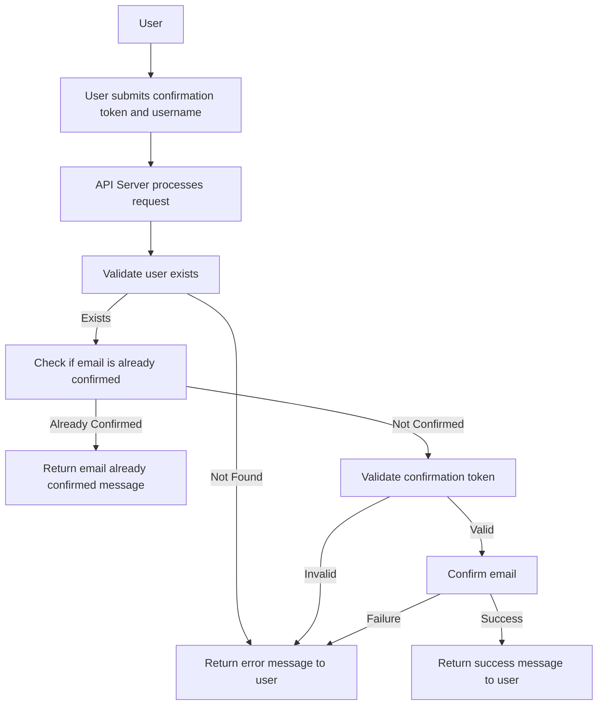
```mermaid
graph TD;
    User-->Submit_Confirmation_Token[User submits confirmation token and username];
    Submit_Confirmation_Token-->API_Server[API Server processes request];
    API_Server-->Validate_User[Validate user exists];
    Validate_User-->|Not Found|Return_Error[Return invalid user error];
    Validate_User-->|Exists|Check_Email_Confirmed[Check if email is already confirmed];
    Check_Email_Confirmed-->|Already Confirmed|Return_Already_Confirmed[Return email already confirmed message];
    Check_Email_Confirmed-->|Not Confirmed|Validate_Token[Validate confirmation token];
    Validate_Token-->|Invalid|Return_Error[Return invalid token error];
    Validate_Token-->|Valid|Confirm_Email[Confirm email];
    Confirm_Email-->|Success|Return_Success[Return success message to user];
    Confirm_Email-->|Failure|Return_Error[Return error message to user];
```

- **Explanation**:
  - The user submits their username and the confirmation token received via email.
  - The server verifies that the user exists and that the email has not already been confirmed.
  - If the email is not confirmed and the token is valid, the email is confirmed, and the user is notified of the success.
  - If the email is already confirmed or the token is invalid, the appropriate error message is returned.

#### Decision Log

- **Token Validation**: The decision to validate the confirmation token ensures that only users with legitimate access can confirm their email addresses.
- **Preventing Duplicate Confirmations**: The system checks if the email is already confirmed to prevent unnecessary confirmation attempts and to provide clear feedback to the user.
- **Detailed Error Handling**: The system provides detailed error messages to assist users in troubleshooting issues with email confirmation, guiding them to the next steps.

#### Endpoints and API Documentation

#### Endpoint Description

This endpoint handles the confirmation of email addresses by validating the provided confirmation token and updating the user's account status if the token is valid.

#### URL

`POST /api/v{version}/Auth/confirm-email`

#### HTTP Method

`POST`

#### Request Headers

- **Content-Type**: `application/json`

#### Request Body

```json
{
	"userName": "johndoe",
	"token": "eyJhbGciOiJIUzI1NiIsInR5cCI6IkpXVCJ9..."
}
```

- **userName**: The username associated with the account (required).
- **token**: The email confirmation token that was sent to the user's email (required).

#### Response

- **Success (200 OK)**

```json
{
	"isSuccess": true,
	"message": "Your email has been confirmed.",
	"result": {
		"userName": "johndoe",
		"email": "johndoe@example.com",
		"firstName": "John",
		"lastName": "Doe"
	}
}
```

- **isSuccess**: Indicates whether the email confirmation was successful.
- **message**: A message confirming that the email has been confirmed.
- **result**: Contains the user's details, including username, email, first name, and last name.

- **Error (400 Bad Request)**

```json
{
	"isSuccess": false,
	"message": "Invalid Email Confirmation Request",
	"result": null
}
```

- **isSuccess**: Indicates that the email confirmation request failed.
- **message**: A message explaining why the email confirmation request was invalid (e.g., invalid token, unregistered username).

- **Already Confirmed (409 Conflict)**

```json
{
	"isSuccess": false,
	"message": "The email for this account has been confirmed already.",
	"result": null
}
```

- **isSuccess**: Indicates that the email has already been confirmed.
- **message**: A message explaining that the email was previously confirmed.

#### Roles and Permissions

- **Public Access**: This endpoint is publicly accessible as it is required for confirming user email addresses.
- **Rate Limiting**: To prevent abuse, rate limiting may be applied to this endpoint.

---

### Feature Name: Refresh Token

#### Feature Overview

The **Refresh Token** feature allows users to obtain a new access token when their current access token has expired, without requiring them to re-authenticate with their username and password. This feature is crucial for maintaining a seamless user experience while ensuring security, as it allows users to stay logged in without continuously re-entering their credentials. The refresh token is issued alongside the access token and can be used to request a new access token when the original expires. This feature ensures that only authorized users can obtain new tokens, as it involves validating the refresh token against the stored token and its expiry time.

#### User Stories

- **As a user**, I want to be able to refresh my access token when it expires so that I can continue using the application without re-entering my credentials.
- **As a developer**, I need to ensure that the refresh token process is secure and that only valid tokens are accepted, preventing unauthorized access.
- **As an administrator**, I want to monitor and limit the lifespan of refresh tokens to reduce the risk of token misuse or theft.

#### Flow Diagram

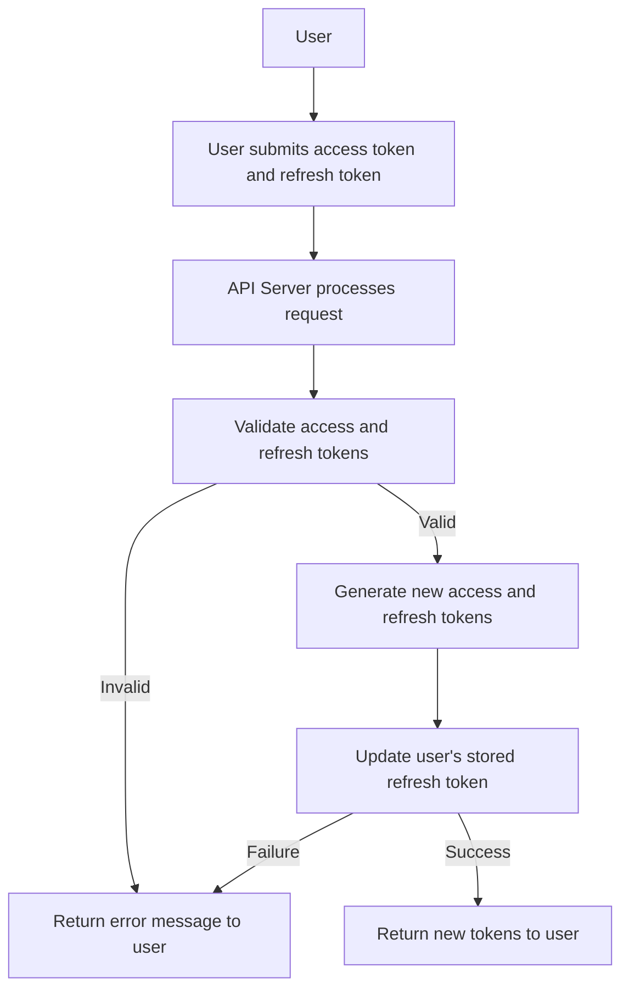
```mermaid
graph TD;
    User-->Submit_Refresh_Token[User submits access token and refresh token];
    Submit_Refresh_Token-->API_Server[API Server processes request];
    API_Server-->Validate_Tokens[Validate access and refresh tokens];
    Validate_Tokens-->|Invalid|Return_Error[Return invalid token error];
    Validate_Tokens-->|Valid|Generate_New_Tokens[Generate new access and refresh tokens];
    Generate_New_Tokens-->Update_User_Token[Update user's stored refresh token];
    Update_User_Token-->|Success|Return_Success[Return new tokens to user];
    Update_User_Token-->|Failure|Return_Error[Return error message to user];
```

- **Explanation**:
  - The user submits both the expired access token and the refresh token.
  - The server validates both tokens and checks if the refresh token is still valid.
  - If the tokens are valid, the server generates a new access token and refresh token, updates the stored refresh token in the database, and returns the new tokens to the user.
  - If the tokens are invalid or the refresh token has expired, an appropriate error message is returned.

#### Decision Log

- **Token Validation**: The decision to validate both the access token and refresh token ensures that only legitimate users can refresh their tokens, enhancing security.
- **Refresh Token Expiry**: Refresh tokens have an expiration date to reduce the risk of long-term token misuse. This ensures that even if a token is compromised, it cannot be used indefinitely.
- **Token Rotation**: Each time a refresh token is used, a new refresh token is issued and stored, invalidating the previous one. This strategy prevents replay attacks.

#### Endpoints and API Documentation

#### Endpoint Description

This endpoint handles the refresh token process by validating the provided access and refresh tokens, generating new tokens if valid, and updating the user's stored refresh token.

#### URL

`POST /api/v{version}/Auth/refresh-token`

#### HTTP Method

`POST`

#### Request Headers

- **Content-Type**: `application/json`

#### Request Body

```json
{
	"accessToken": "eyJhbGciOiJIUzI1NiIsInR5cCI6IkpXVCJ9...",
	"refreshToken": "A0b1C2d3E4f5G6h7I8j9..."
}
```

- **accessToken**: The expired access token that needs to be refreshed (required).
- **refreshToken**: The refresh token issued alongside the access token (required).

#### Response

- **Success (200 OK)**

```json
{
	"isSuccess": true,
	"message": "Success",
	"result": {
		"accessToken": "newAccessToken123",
		"refreshToken": "newRefreshToken123"
	}
}
```

- **isSuccess**: Indicates whether the token refresh was successful.
- **message**: A message confirming that the new tokens were generated successfully.
- **result**: Contains the new access token and refresh token.

- **Error (400 Bad Request)**

```json
{
	"isSuccess": false,
	"message": "Invalid access token or refresh token",
	"result": null
}
```

- **isSuccess**: Indicates that the token refresh request failed.
- **message**: A message explaining why the token refresh request was invalid (e.g., invalid token, expired refresh token).

#### Roles and Permissions

- **Authenticated Access**: This endpoint requires the user to have a valid (albeit expired) access token and a valid refresh token.
- **Rate Limiting**: To prevent abuse, rate limiting may be applied to this endpoint.

---

### Feature Name: Update Profile

#### Feature Overview

The **Update Profile** feature allows authenticated users to update their personal information, including their first name, last name, and profile picture. This feature enhances user experience by enabling them to maintain up-to-date personal details and customize their profiles. The process involves submitting new profile details, optionally including a profile picture, which is then validated and uploaded to a cloud storage service. The user’s information is subsequently updated in the database.

#### User Stories

- **As a user**, I want to update my profile details, including my name and profile picture, so that my account reflects my current information.
- **As a system administrator**, I want to ensure that users can easily update their profiles while maintaining data integrity and security.
- **As a developer**, I need to securely handle profile updates, including file uploads, to prevent unauthorized access and ensure data consistency.

#### Flow Diagram

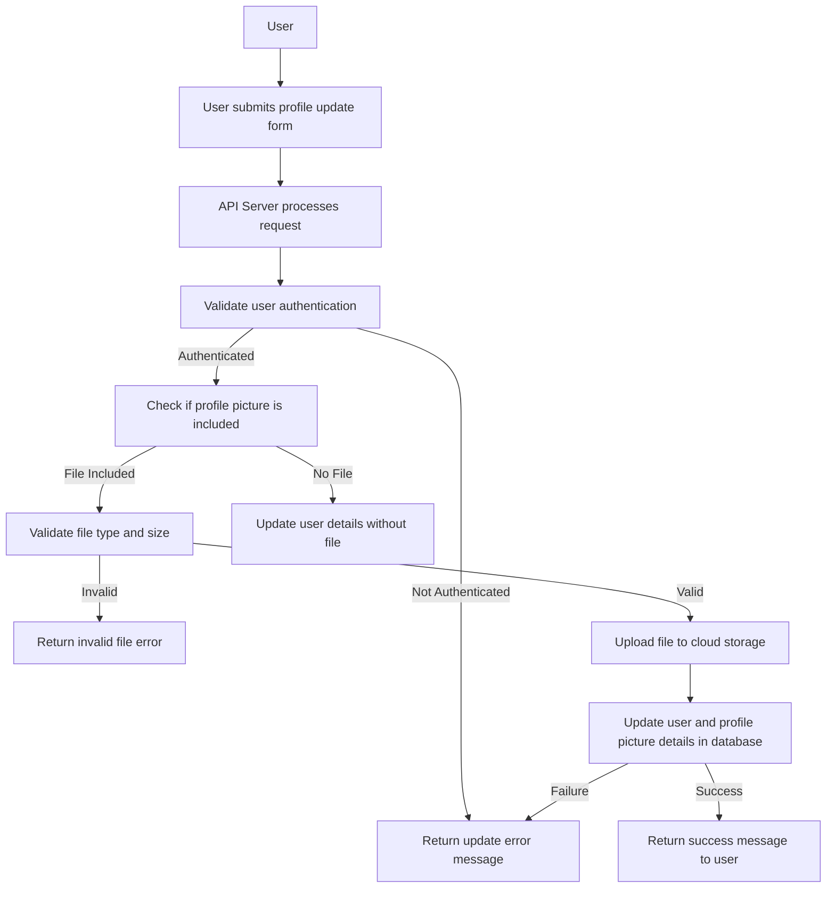
```mermaid
graph TD;
    User-->Submit_Profile_Update[User submits profile update form];
    Submit_Profile_Update-->API_Server[API Server processes request];
    API_Server-->Validate_User[Validate user authentication];
    Validate_User-->|Not Authenticated|Return_Error[Return unauthorized error];
    Validate_User-->|Authenticated|Check_File_Upload[Check if profile picture is included];
    Check_File_Upload-->|File Included|Validate_File[Validate file type and size];
    Check_File_Upload-->|No File|Update_User_Details[Update user details without file];
    Validate_File-->|Invalid|Return_File_Error[Return invalid file error];
    Validate_File-->|Valid|Upload_File[Upload file to cloud storage];
    Upload_File-->Update_User_And_Profile[Update user and profile picture details in database];
    Update_User_And_Profile-->|Success|Return_Success[Return success message to user];
    Update_User_And_Profile-->|Failure|Return_Error[Return update error message];
```

- **Explanation**:
  - The user submits their updated profile details, including their name and an optional profile picture.
  - The server first validates the user’s authentication status.
  - If a file is included, it is validated before being uploaded to cloud storage.
  - The user's details are then updated in the database, including the profile picture if applicable.
  - The server returns a success message if the update is successful, or an error message if any issues occur during the process.

#### Decision Log

- **File Validation**: The system includes strict validation of the uploaded file to ensure only valid file types and sizes are accepted, enhancing security.
- **Cloud Storage Integration**: Profile pictures are stored in cloud storage, leveraging scalability and reliability for storing user-generated content.
- **Error Handling**: Detailed error messages are provided to guide users in case of failures, ensuring a clear understanding of what went wrong and how to resolve it.

#### Endpoints and API Documentation

#### Endpoint Description

This endpoint allows authenticated users to update their profile information, including their first name, last name, and profile picture. The endpoint handles file validation, storage, and updates the user’s information in the database.

#### URL

`PUT /api/v{version}/Auth/update-profile`

#### HTTP Method

`PUT`

#### Request Headers

- **Authorization**: `Bearer {token}` (required)
- **Content-Type**: `multipart/form-data`

#### Request Body

The request body should be multipart/form-data, containing the following fields:

```json
{
	"file": "profile_picture.jpg", // Optional, the profile picture file to be uploaded
	"firstName": "John", // Required, the new first name of the user
	"lastName": "Doe" // Required, the new last name of the user
}
```

- **file**: The profile picture to be uploaded (optional, should be of a valid type and within size limits).
- **firstName**: The new first name of the user (required).
- **lastName**: The new last name of the user (required).

#### Response

- **Success (200 OK)**

```json
{
	"isSuccess": true,
	"message": "Profile updated successfully",
	"result": null
}
```

- **isSuccess**: Indicates whether the profile update was successful.
- **message**: A message confirming that the profile was updated.
- **result**: This field is typically null for this response.

- **Error (400 Bad Request)**

```json
{
	"isSuccess": false,
	"message": "Invalid file type or size",
	"result": null
}
```

- **isSuccess**: Indicates that the profile update request failed.
- **message**: A message explaining why the profile update request was invalid (e.g., invalid file type or size).

- **Error (401 Unauthorized)**

```json
{
	"isSuccess": false,
	"message": "Unauthorized request",
	"result": null
}
```

- **isSuccess**: Indicates that the profile update request failed due to lack of authentication.
- **message**: A message indicating that the user needs to be authenticated to perform this action.

#### Roles and Permissions

- **Authenticated Access**: This endpoint requires the user to be authenticated with a valid token.
- **Rate Limiting**: To prevent abuse, rate limiting may be applied to this endpoint.

---

### Feature Name: Submit Feedback

#### Feature Overview

The **Submit Feedback** feature allows authenticated users to provide feedback about the application. This feature enables users to communicate issues, suggestions, or other comments directly to the development team, improving the overall quality and user experience of the application. The feedback is categorized, described, and optionally supplemented with additional information. Once submitted, the feedback is stored in the database, and the user receives confirmation of the successful submission.

#### User Stories

- **As a user**, I want to submit feedback about my experience with the application so that the development team can address my concerns or suggestions.
- **As an administrator**, I want to receive structured feedback from users, categorized by type, to prioritize improvements and fixes.
- **As a developer**, I need a reliable and secure mechanism for collecting user feedback, ensuring that submissions are stored correctly and can be acted upon.

#### Flow Diagram

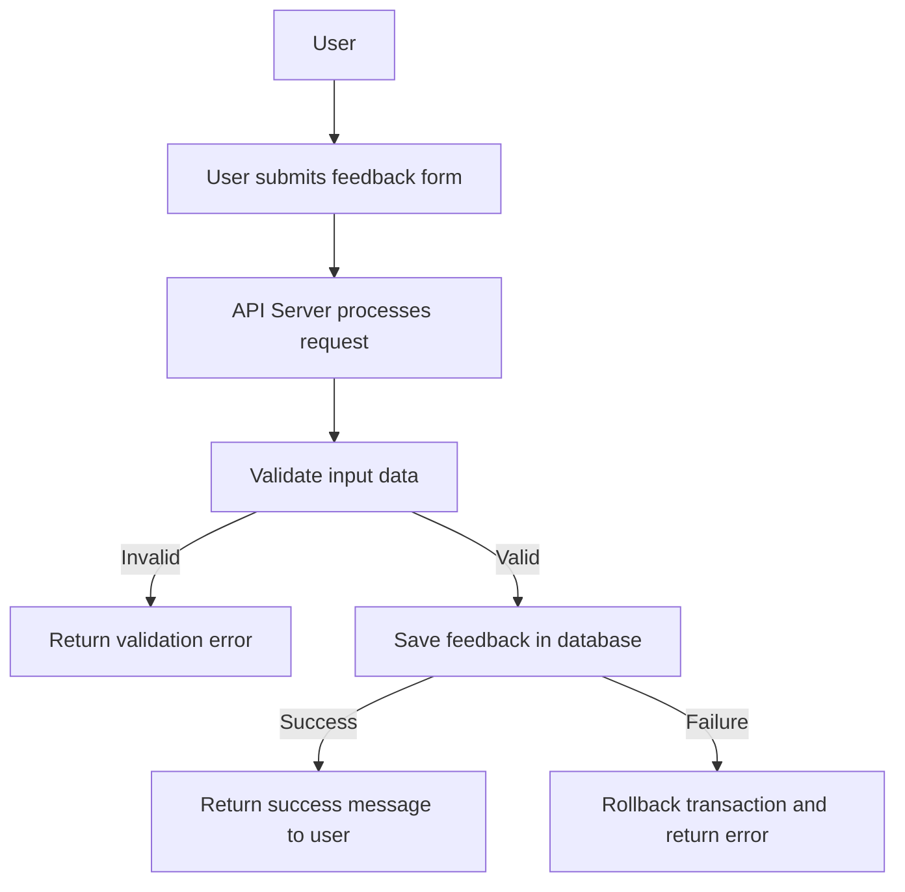
```mermaid
graph TD;
    User-->Submit_Feedback_Form[User submits feedback form];
    Submit_Feedback_Form-->API_Server[API Server processes request];
    API_Server-->Validate_Input[Validate input data];
    Validate_Input-->|Invalid|Return_Error[Return validation error];
    Validate_Input-->|Valid|Save_Feedback[Save feedback in database];
    Save_Feedback-->|Success|Return_Success[Return success message to user];
    Save_Feedback-->|Failure|Rollback_Transaction[Rollback transaction and return error];
```

- **Explanation**:
  - The user submits feedback through a form.
  - The server validates the input data to ensure all required fields are present and correctly formatted.
  - If the data is valid, the feedback is saved in the database, and a success message is returned to the user.
  - If an error occurs during the save process, the transaction is rolled back, and an error message is returned.

#### Decision Log

- **Transaction Management**: The decision to use transactions ensures that feedback is only saved if all operations complete successfully, maintaining data integrity.
- **Input Validation**: Input validation is enforced to prevent incomplete or malformed feedback submissions, ensuring that the data stored is useful and actionable.
- **Feedback Categorization**: The inclusion of a category field allows feedback to be easily sorted and prioritized by the development team.

#### Endpoints and API Documentation

#### Endpoint Description

This endpoint allows authenticated users to submit feedback about the application. The feedback is categorized and stored in the database for further review and action by the development team.

#### URL

`POST /api/v{version}/Feedback`

#### HTTP Method

`POST`

#### Request Headers

- **Authorization**: `Bearer {token}` (required)
- **Content-Type**: `application/json`

#### Request Body

```json
{
	"category": "Bug Report",
	"description": "There is an issue with the login feature.",
	"additionalInfo": "Occurs only on mobile devices."
}
```

- **category**: The category of feedback (e.g., Bug Report, Feature Request) (required).
- **description**: A detailed description of the feedback (required).
- **additionalInfo**: Any additional information that may help in addressing the feedback (optional).

#### Response

- **Success (201 Created)**

```json
{
	"isSuccess": true,
	"message": "Feedback submitted successfully.",
	"result": "feedback-id-12345"
}
```

- **isSuccess**: Indicates whether the feedback submission was successful.
- **message**: A message confirming that the feedback was submitted.
- **result**: The unique ID of the submitted feedback.

- **Error (400 Bad Request)**

```json
{
	"isSuccess": false,
	"message": "Invalid input data.",
	"result": null
}
```

- **isSuccess**: Indicates that the feedback submission failed due to invalid input.
- **message**: A message explaining why the submission failed (e.g., missing required fields).

- **Error (500 Internal Server Error)**

```json
{
	"isSuccess": false,
	"message": "An error occurred while submitting feedback.",
	"result": null
}
```

- **isSuccess**: Indicates that the feedback submission failed due to a server-side error.
- **message**: A message explaining that an internal error occurred during submission.

#### Roles and Permissions

- **Authenticated Access**: This endpoint requires the user to be authenticated with a valid token.
- **Rate Limiting**: To prevent abuse, rate limiting may be applied to this endpoint to control the number of submissions within a given time frame.

---

### Feature Name: Retrieves all feedback. Admin only.

#### Feature Overview

The **Retrieves all feedback** feature allows administrators to access all user feedback submitted within the application. This feature is designed to enable admins to review, categorize, and act on user feedback to improve the application’s functionality and user experience. Administrators can filter feedback by user ID to view feedback submitted by specific users. This functionality is restricted to users with the "Admin" role to ensure that sensitive feedback data is protected.

#### User Stories

- **As an admin**, I want to retrieve all feedback submitted by users so that I can review and address their concerns and suggestions.
- **As an admin**, I want to filter feedback by user ID so that I can view feedback from specific users when necessary.
- **As a security officer**, I want to restrict access to feedback data to only authorized users (admins) to maintain confidentiality and data security.

#### Flow Diagram

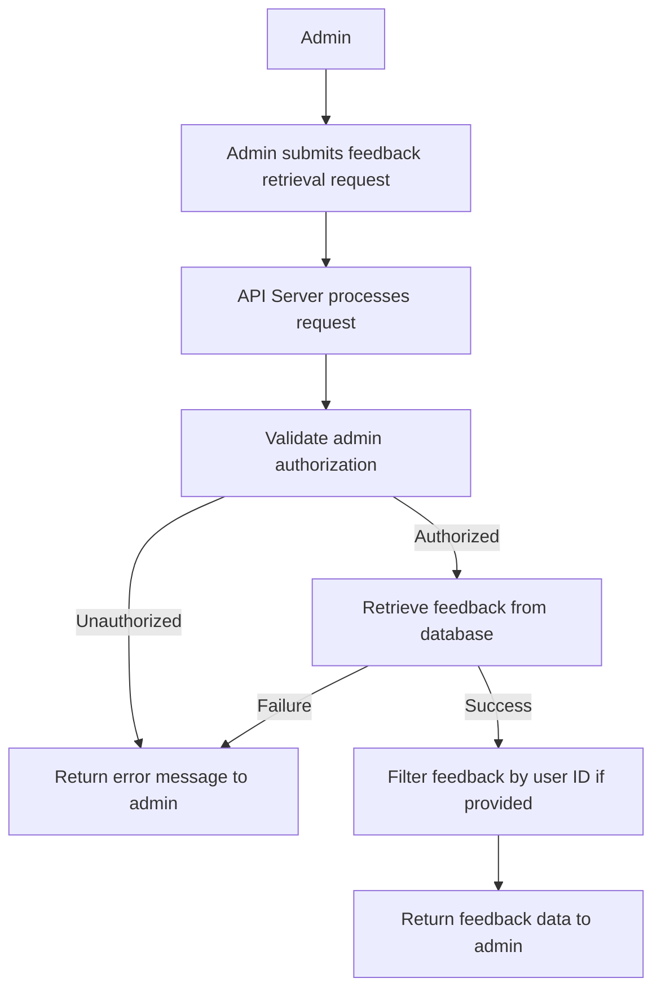
```mermaid
graph TD;
    Admin-->Submit_Feedback_Request[Admin submits feedback retrieval request];
    Submit_Feedback_Request-->API_Server[API Server processes request];
    API_Server-->Validate_Admin[Validate admin authorization];
    Validate_Admin-->|Unauthorized|Return_Error[Return unauthorized access error];
    Validate_Admin-->|Authorized|Retrieve_Feedback[Retrieve feedback from database];
    Retrieve_Feedback-->|Success|Filter_By_User[Filter feedback by user ID if provided];
    Filter_By_User-->Return_Success[Return feedback data to admin];
    Retrieve_Feedback-->|Failure|Return_Error[Return error message to admin];
```

- **Explanation**:
  - The admin submits a request to retrieve all feedback.
  - The server validates whether the requester has admin privileges.
  - If the requester is not authorized, an error message is returned.
  - If authorized, the feedback is retrieved from the database, optionally filtered by user ID.
  - The server returns the feedback data to the admin or an error message if any issues occur.

#### Decision Log

- **Role-Based Access Control**: The decision to restrict feedback retrieval to admins ensures that sensitive user feedback is handled securely and only by authorized personnel.
- **Filtering by User ID**: Adding the ability to filter feedback by user ID provides flexibility for admins to target specific users’ feedback, improving the efficiency of the feedback review process.
- **Detailed Error Handling**: The system logs all access attempts and provides detailed error messages to ensure transparency and security.

#### Endpoints and API Documentation

#### Endpoint Description

This endpoint allows administrators to retrieve all feedback submitted by users. The feedback can be optionally filtered by user ID, and only users with the "Admin" role have access to this endpoint.

#### URL

`PUT /api/v{version}/Feedback`

#### HTTP Method

`PUT`

#### Request Headers

- **Authorization**: `Bearer {token}` (required)
- **Content-Type**: `application/json`

#### Request Body

```json
{
	"userId": "optional-user-id"
}
```

- **userId**: The ID of the user whose feedback should be retrieved (optional). If not provided, all feedback is retrieved.

#### Response

- **Success (200 OK)**

```json
{
	"isSuccess": true,
	"message": null,
	"result": [
		{
			"feedbackId": "feedback-id-12345",
			"category": "Bug Report",
			"description": "There is an issue with the login feature.",
			"submittedBy": "user-id-67890",
			"submittedOn": "2024-01-01T12:00:00Z"
		},
		{
			"feedbackId": "feedback-id-67890",
			"category": "Feature Request",
			"description": "Please add dark mode.",
			"submittedBy": "user-id-12345",
			"submittedOn": "2024-01-02T12:00:00Z"
		}
	]
}
```

- **isSuccess**: Indicates whether the feedback retrieval was successful.
- **message**: Typically null in a successful response.
- **result**: An array of feedback objects, each containing the feedback ID, category, description, user ID, and submission date.

- **Error (401 Unauthorized)**

```json
{
	"isSuccess": false,
	"message": "Unauthorized access.",
	"result": null
}
```

- **isSuccess**: Indicates that the feedback retrieval request failed due to lack of authorization.
- **message**: A message explaining that the requester does not have the necessary permissions to access the feedback.

- **Error (500 Internal Server Error)**

```json
{
	"isSuccess": false,
	"message": "An error occurred while fetching feedback.",
	"result": null
}
```

- **isSuccess**: Indicates that the feedback retrieval request failed due to a server-side error.
- **message**: A message explaining that an internal error occurred during the retrieval process.

#### Roles and Permissions

- **Admin Access**: This endpoint is restricted to users with the "Admin" role.
- **Security Logging**: All access attempts are logged, and unauthorized attempts are flagged for review.

---

### Feature Name: Updates feedback status. Admin only.

#### Feature Overview

The **Updates Feedback Status** feature allows administrators to update the status of feedback submitted by users. This feature is essential for tracking the progress of user-reported issues, feature requests, or other types of feedback. Administrators can change the status of the feedback (e.g., from "Pending" to "In Progress" or "Resolved") and add comments to provide context or updates. This helps maintain transparency and keeps the feedback loop active between users and the development team.

#### User Stories

- **As an admin**, I want to update the status of feedback so that users can be informed about the progress and resolution of their submissions.
- **As an admin**, I want to add comments to feedback status updates so that users and other admins can understand the context behind the status change.
- **As a user**, I want to see the status of my feedback updated to know that it is being addressed by the development team.

#### Flow Diagram

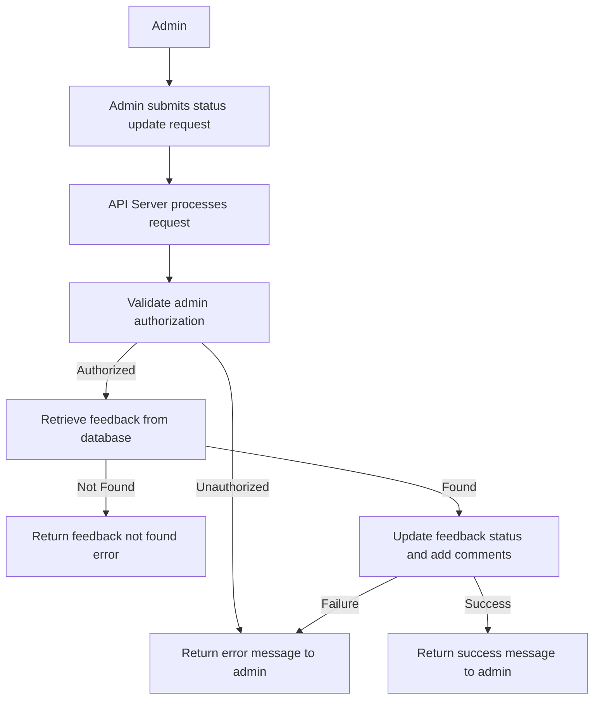
```mermaid
graph TD;
    Admin-->Submit_Status_Update[Admin submits status update request];
    Submit_Status_Update-->API_Server[API Server processes request];
    API_Server-->Validate_Admin[Validate admin authorization];
    Validate_Admin-->|Unauthorized|Return_Error[Return unauthorized access error];
    Validate_Admin-->|Authorized|Retrieve_Feedback[Retrieve feedback from database];
    Retrieve_Feedback-->|Not Found|Return_Not_Found[Return feedback not found error];
    Retrieve_Feedback-->|Found|Update_Feedback_Status[Update feedback status and add comments];
    Update_Feedback_Status-->|Success|Return_Success[Return success message to admin];
    Update_Feedback_Status-->|Failure|Return_Error[Return error message to admin];
```

- **Explanation**:
  - The admin submits a request to update the status of a specific piece of feedback.
  - The server validates the admin’s authorization to ensure that only authorized personnel can update feedback status.
  - If the feedback is found, the status is updated along with any comments provided by the admin.
  - The server returns a success message if the update is successful or an error message if any issues occur during the process.

#### Decision Log

- **Role-Based Access Control**: The decision to restrict this operation to admins ensures that feedback status updates are managed securely and by authorized personnel only.
- **Feedback Status Tracking**: Implementing a status update feature allows for better tracking of feedback and its resolution process, improving transparency with users.
- **Detailed Logging**: The system logs all status update attempts, especially those that fail due to unauthorized access or errors, to ensure accountability and traceability.

#### Endpoints and API Documentation

#### Endpoint Description

This endpoint allows administrators to update the status of a specific piece of feedback. The status can be changed to reflect the current state of the feedback (e.g., "In Progress," "Resolved") and optional comments can be added for further context.

#### URL

`PUT /api/v{version}/Feedback/{feedbackId}/status`

#### HTTP Method

`PUT`

#### Request Headers

- **Authorization**: `Bearer {token}` (required)
- **Content-Type**: `application/json`

#### Request Body

```json
{
	"status": "Resolved",
	"adminComments": "Issue has been fixed in the latest update."
}
```

- **status**: The new status of the feedback (required).
- **adminComments**: Optional comments from the admin regarding the status update (optional but recommended for context).

#### Response

- **Success (200 OK)**

```json
{
	"isSuccess": true,
	"message": "Feedback status updated successfully.",
	"result": true
}
```

- **isSuccess**: Indicates whether the status update was successful.
- **message**: A message confirming that the feedback status was updated.
- **result**: A boolean value indicating the success of the operation.

- **Error (401 Unauthorized)**

```json
{
	"isSuccess": false,
	"message": "Unauthorized access.",
	"result": null
}
```

- **isSuccess**: Indicates that the status update request failed due to lack of authorization.
- **message**: A message explaining that the requester does not have the necessary permissions to update the feedback status.

- **Error (404 Not Found)**

```json
{
	"isSuccess": false,
	"message": "Feedback not found.",
	"result": null
}
```

- **isSuccess**: Indicates that the feedback ID provided does not exist.
- **message**: A message explaining that the feedback was not found.

- **Error (500 Internal Server Error)**

```json
{
	"isSuccess": false,
	"message": "An error occurred while updating feedback status.",
	"result": null
}
```

- **isSuccess**: Indicates that the status update request failed due to a server-side error.
- **message**: A message explaining that an internal error occurred during the status update process.

#### Roles and Permissions

- **Admin Access**: This endpoint is restricted to users with the "Admin" role.
- **Security Logging**: All access attempts and status updates are logged for security and accountability purposes.

---

### Feature Name: Responds to feedback. Admin only.

#### Feature Overview

The **Responds to Feedback** feature allows administrators to submit a response to user feedback. This feature is critical for maintaining communication between the development team and users, ensuring that users receive acknowledgment and updates regarding their submitted feedback. Admins can provide detailed responses that are saved alongside the feedback entry in the system. This process helps close the feedback loop, making users feel heard and valued.

#### User Stories

- **As an admin**, I want to respond to user feedback directly within the system so that users are informed about the status and consideration of their feedback.
- **As an admin**, I want to ensure that my responses are securely recorded and associated with the relevant feedback entry.
- **As a user**, I want to receive responses to the feedback I’ve submitted, so I know that my input is being addressed by the team.

#### Flow Diagram


```mermaid
graph TD;
    Admin-->Submit_Response[Admin submits feedback response];
    Submit_Response-->API_Server[API Server processes request];
    API_Server-->Validate_Admin[Validate admin authorization];
    Validate_Admin-->|Unauthorized|Return_Error[Return unauthorized access error];
    Validate_Admin-->|Authorized|Retrieve_Feedback[Retrieve feedback from database];
    Retrieve_Feedback-->|Not Found|Return_Not_Found[Return feedback not found error];
    Retrieve_Feedback-->|Found|Save_Response[Save admin response to feedback];
    Save_Response-->|Success|Return_Success[Return success message to admin];
    Save_Response-->|Failure|Return_Error[Return error message to admin];
```

- **Explanation**:
  - The admin submits a response to a specific piece of feedback.
  - The server validates whether the requester has admin privileges.
  - If the feedback is found, the admin’s response is saved alongside the feedback in the database.
  - The server returns a success message if the response is saved successfully, or an error message if any issues occur during the process.

#### Decision Log

- **Role-Based Access Control**: The decision to restrict the ability to respond to feedback to admins ensures that communication with users is handled securely and appropriately.
- **Feedback Response Logging**: Responses are logged and saved with the feedback entry to ensure that all interactions with user feedback are recorded and can be reviewed.
- **Error Handling**: The system logs errors, particularly unauthorized access attempts or failures during response submission, to maintain security and integrity.

#### Endpoints and API Documentation

#### Endpoint Description

This endpoint allows administrators to submit a response to a specific piece of user feedback. The response is saved alongside the feedback entry, providing users with updates or comments regarding their submissions.

#### URL

`POST /api/v{version}/Feedback/{feedbackId}/response`

#### HTTP Method

`POST`

#### Request Headers

- **Authorization**: `Bearer {token}` (required)
- **Content-Type**: `application/json`

#### Request Body

```json
{
	"response": "Thank you for your feedback. We are currently reviewing the issue."
}
```

- **response**: The response or comment that the admin wishes to provide regarding the feedback (required).

#### Response

- **Success (200 OK)**

```json
{
	"isSuccess": true,
	"message": "Response to feedback submitted successfully.",
	"result": true
}
```

- **isSuccess**: Indicates whether the response submission was successful.
- **message**: A message confirming that the response was submitted successfully.
- **result**: A boolean value indicating the success of the operation.

- **Error (401 Unauthorized)**

```json
{
	"isSuccess": false,
	"message": "Unauthorized access.",
	"result": null
}
```

- **isSuccess**: Indicates that the response submission request failed due to lack of authorization.
- **message**: A message explaining that the requester does not have the necessary permissions to submit a response.

- **Error (404 Not Found)**

```json
{
	"isSuccess": false,
	"message": "Feedback not found.",
	"result": null
}
```

- **isSuccess**: Indicates that the feedback ID provided does not exist.
- **message**: A message explaining that the feedback was not found.

- **Error (500 Internal Server Error)**

```json
{
	"isSuccess": false,
	"message": "An error occurred while responding to feedback.",
	"result": null
}
```

- **isSuccess**: Indicates that the response submission request failed due to a server-side error.
- **message**: A message explaining that an internal error occurred during the response submission process.

#### Roles and Permissions

- **Admin Access**: This endpoint is restricted to users with the "Admin" role.
- **Security Logging**: All access attempts and response submissions are logged for security and accountability purposes.

---

### Feature Name: Create Invoice

#### Feature Overview

The **Create Invoice** feature allows authenticated users to generate a new invoice within the application. This feature supports both one-time and recurring invoices, enabling users to specify detailed billing information, including client details, payment terms, and items being billed. The invoice can be saved as a draft or marked as ready for submission depending on the user's preference. This feature is essential for managing billing processes efficiently within the application.

#### User Stories

- **As a user**, I want to create an invoice with detailed billing information so that I can accurately bill my clients.
- **As a user**, I want to create recurring invoices to automate regular billing processes.
- **As a user**, I want to save invoices as drafts if they are not ready to be finalized, so I can complete them later.
- **As a user**, I want to specify when an invoice is ready to be sent, so the system knows whether to treat it as a draft or a finalized invoice.

#### Flow Diagram

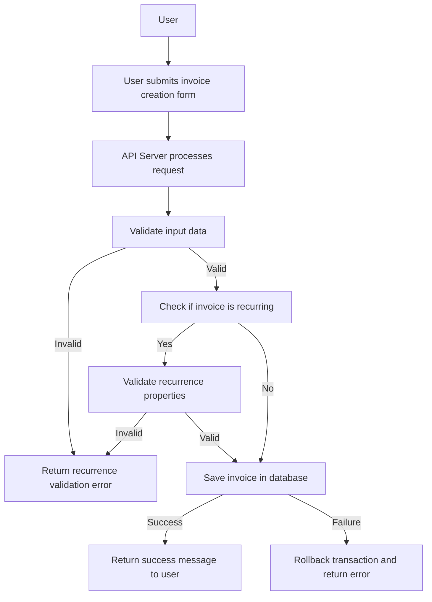
```mermaid
graph TD;
    User-->Submit_Invoice_Form[User submits invoice creation form];
    Submit_Invoice_Form-->API_Server[API Server processes request];
    API_Server-->Validate_Input[Validate input data];
    Validate_Input-->|Invalid|Return_Error[Return validation error];
    Validate_Input-->|Valid|Check_Recurrence[Check if invoice is recurring];
    Check_Recurrence-->|Yes|Validate_Recurrence[Validate recurrence properties];
    Validate_Recurrence-->|Invalid|Return_Error[Return recurrence validation error];
    Validate_Recurrence-->|Valid|Save_Invoice[Save invoice in database];
    Check_Recurrence-->|No|Save_Invoice[Save invoice in database];
    Save_Invoice-->|Success|Return_Success[Return success message to user];
    Save_Invoice-->|Failure|Rollback_Transaction[Rollback transaction and return error];
```

- **Explanation**:
  - The user submits the invoice creation form, which includes details such as client information, payment terms, and items.
  - The server validates the input data to ensure all required fields are present and correctly formatted.
  - If the invoice is recurring, additional validation checks are performed to ensure the recurrence details are correct.
  - Once validated, the invoice is saved to the database, and the server returns a success message to the user.
  - If any errors occur during the process, the transaction is rolled back, and an error message is returned.

#### Decision Log

- **Recurrence Validation**: The decision to validate recurrence details for recurring invoices ensures that users cannot create invalid recurring invoices, preventing potential billing errors.
- **Draft vs. Finalized Invoice**: The feature allows users to specify whether the invoice is a draft or ready for submission, providing flexibility in the invoice creation process.
- **Error Handling**: The system includes detailed error handling, especially for input validation and recurrence properties, to guide users in correcting any issues before submission.

#### Endpoints and API Documentation

#### Endpoint Description

This endpoint allows authenticated users to create a new invoice. The invoice can be configured with various details, including client information, payment terms, items, and recurrence options. The invoice can be saved as a draft or marked as ready for submission.

#### URL

`POST /api/v{version}/Invoice/create`

#### HTTP Method

`POST`

#### Request Headers

- **Authorization**: `Bearer {token}` (required)
- **Content-Type**: `application/json`

#### Request Body

```json
{
	"description": "Consulting services for July 2024",
	"paymentTerms": 30,
	"clientName": "ABC Corp",
	"clientEmail": "client@abccorp.com",
	"createdAt": "2024-07-01",
	"isReady": true,
	"senderAddress": {
		"street": "123 Main St",
		"city": "Metropolis",
		"postCode": "12345",
		"country": "USA"
	},
	"clientAddress": {
		"street": "456 Elm St",
		"city": "Gotham",
		"postCode": "67890",
		"country": "USA"
	},
	"items": [
		{
			"name": "Consulting Fee",
			"quantity": 10,
			"price": 150.0,
			"total": 1500.0
		}
	],
	"isRecurring": true,
	"recurrencePeriod": "Monthly",
	"recurrenceEndDate": "2024-12-01"
}
```

- **description**: A description of the services or goods being billed (required).
- **paymentTerms**: The number of days the client has to pay the invoice (required).
- **clientName**: The name of the client being billed (required).
- **clientEmail**: The email address of the client (required, must be valid).
- **createdAt**: The date the invoice is created (required, must not be in the past).
- **isReady**: A boolean indicating whether the invoice is ready to be sent (required).
- **senderAddress**: The address of the sender (required).
- **clientAddress**: The address of the client (required).
- **items**: A list of items being billed, each with a name, quantity, price, and total (required).
- **isRecurring**: A boolean indicating whether the invoice is recurring (required).
- **recurrencePeriod**: The period for recurrence (e.g., Daily, Weekly, Monthly) (required if `isRecurring` is true).
- **recurrenceEndDate**: The end date for the recurrence (required if `isRecurring` is true).

#### Response

- **Success (201 Created)**

```json
{
	"isSuccess": true,
	"message": "Invoice successfully created",
	"result": "invoice-frontend-id-12345"
}
```

- **isSuccess**: Indicates whether the invoice creation was successful.
- **message**: A message confirming that the invoice was created successfully.
- **result**: The unique frontend ID of the created invoice.

- **Error (400 Bad Request)**

```json
{
	"isSuccess": false,
	"message": "Invalid input data.",
	"result": null
}
```

- **isSuccess**: Indicates that the invoice creation request failed due to invalid input.
- **message**: A message explaining why the submission failed (e.g., missing required fields, invalid date format).

- **Error (500 Internal Server Error)**

```json
{
	"isSuccess": false,
	"message": "An error occurred while creating the invoice.",
	"result": null
}
```

- **isSuccess**: Indicates that the invoice creation request failed due to a server-side error.
- **message**: A message explaining that an internal error occurred during the invoice creation process.

#### Roles and Permissions

- **Authenticated User Access**: This endpoint is accessible to all authenticated users.
- **Security Logging**: All invoice creation attempts are logged for security and auditing purposes.

---

### Feature Name: Get Invoice by Invoice id

#### Feature Overview

The **Get Invoice by Invoice id** feature allows authenticated users to retrieve detailed information about a specific invoice by providing its unique identifier. This feature is essential for users who need to view or verify the details of an invoice they have created. The retrieved invoice includes comprehensive information such as client details, payment terms, items, and the total amount due. This feature ensures that users have easy access to their invoices for review, management, or further action.

#### User Stories

- **As a user**, I want to retrieve a specific invoice by its ID so that I can view the detailed information of the invoice.
- **As a user**, I want to ensure that only invoices I created are accessible to me to maintain privacy and security.
- **As an admin**, I want to ensure that users can easily access their invoices, but only the ones they are authorized to view.

#### Flow Diagram

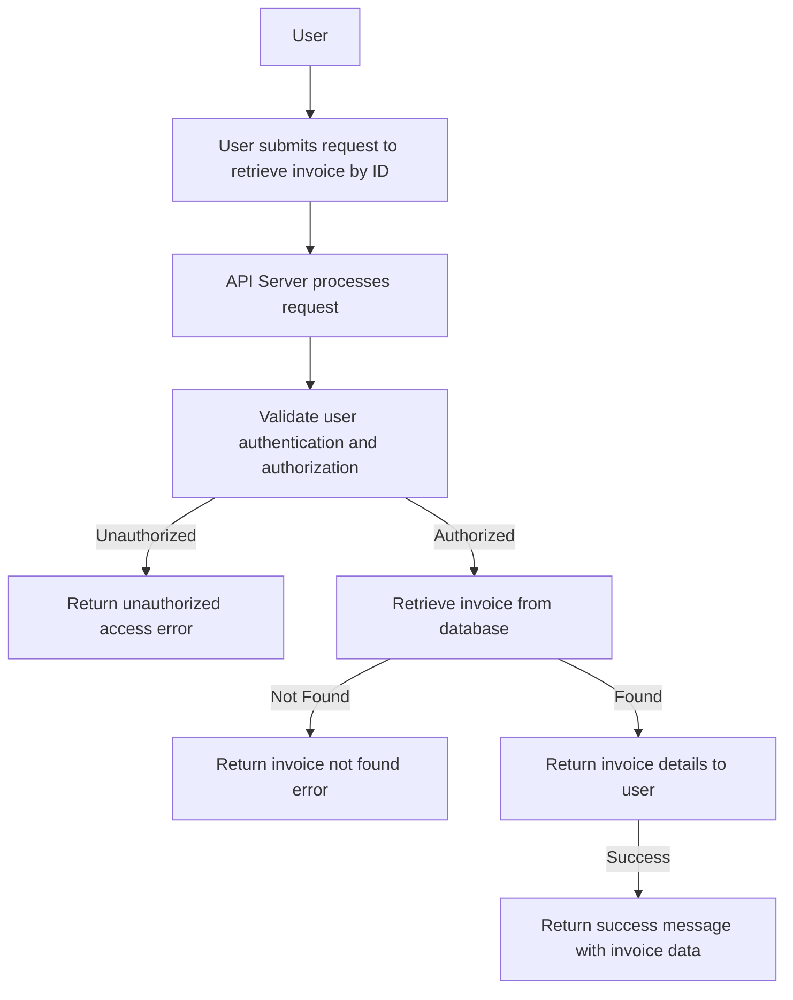
```mermaid
graph TD;
    User-->Submit_Get_Invoice_Request[User submits request to retrieve invoice by ID];
    Submit_Get_Invoice_Request-->API_Server[API Server processes request];
    API_Server-->Validate_User[Validate user authentication and authorization];
    Validate_User-->|Unauthorized|Return_Error[Return unauthorized access error];
    Validate_User-->|Authorized|Retrieve_Invoice[Retrieve invoice from database];
    Retrieve_Invoice-->|Not Found|Return_Not_Found[Return invoice not found error];
    Retrieve_Invoice-->|Found|Return_Invoice[Return invoice details to user];
    Return_Invoice-->|Success|Return_Success[Return success message with invoice data];
```

- **Explanation**:
  - The user submits a request to retrieve an invoice by its unique ID.
  - The server validates the user’s authentication and ensures that the user is authorized to access the requested invoice.
  - If the invoice is found and the user is authorized, the invoice details are returned to the user.
  - If any issues occur, such as the invoice not being found or the user not being authorized, appropriate error messages are returned.

#### Decision Log

- **Authorization Check**: The decision to check whether the user requesting the invoice is the one who created it ensures data security and privacy.
- **Comprehensive Invoice Retrieval**: The feature retrieves all relevant details of the invoice, including client information, items, and payment terms, ensuring users have all necessary information at their disposal.
- **Error Handling**: Detailed error handling is implemented to guide users in case the invoice is not found or they do not have the necessary permissions to view it.

#### Endpoints and API Documentation

#### Endpoint Description

This endpoint allows authenticated users to retrieve detailed information about a specific invoice using its unique ID. The endpoint ensures that only the user who created the invoice can access its details.

#### URL

`GET /api/v{version}/Invoice/{id}`

#### HTTP Method

`GET`

#### Request Headers

- **Authorization**: `Bearer {token}` (required)

#### Request Body

- **None**: This is a GET request, so the invoice ID is passed directly in the URL.

#### Response

- **Success (200 OK)**

```json
{
	"isSuccess": true,
	"message": "Invoice successfully returned",
	"result": {
		"id": "invoice-id-12345",
		"frontendId": "invoice-frontend-id-12345",
		"createdAt": "2024-07-01T12:00:00Z",
		"paymentDue": "2024-07-31T12:00:00Z",
		"description": "Consulting services for July 2024",
		"paymentTerms": 30,
		"clientName": "ABC Corp",
		"clientEmail": "client@abccorp.com",
		"status": "Pending",
		"senderAddress": {
			"street": "123 Main St",
			"city": "Metropolis",
			"postCode": "12345",
			"country": "USA"
		},
		"clientAddress": {
			"street": "456 Elm St",
			"city": "Gotham",
			"postCode": "67890",
			"country": "USA"
		},
		"total": 1500.0,
		"items": [
			{
				"name": "Consulting Fee",
				"quantity": 10,
				"price": 150.0,
				"total": 1500.0
			}
		]
	}
}
```

- **isSuccess**: Indicates whether the invoice retrieval was successful.
- **message**: A message confirming that the invoice was successfully retrieved.
- **result**: The detailed information of the invoice, including client details, payment terms, items, and the total amount.

- **Error (403 Forbidden)**

```json
{
	"isSuccess": false,
	"message": "The invoice doesn't exist",
	"result": null
}
```

- **isSuccess**: Indicates that the invoice retrieval request failed due to lack of authorization.
- **message**: A message explaining that the user is not authorized to view this invoice or that the invoice does not exist.

- **Error (500 Internal Server Error)**

```json
{
	"isSuccess": false,
	"message": "An error occurred while retrieving the invoice.",
	"result": null
}
```

- **isSuccess**: Indicates that the invoice retrieval request failed due to a server-side error.
- **message**: A message explaining that an internal error occurred during the invoice retrieval process.

#### Roles and Permissions

- **Authenticated User Access**: This endpoint is accessible to all authenticated users, but only for invoices they created.
- **Security Logging**: All invoice retrieval attempts are logged for security and auditing purposes.

---

### Feature Name: Get All Invoice for a User

#### Feature Overview

The **Get All Invoice for a User** feature allows administrators to retrieve a list of all invoices associated with a specific user. This feature is essential for administrative users who need to review or manage the invoices generated by a particular user. The returned data includes comprehensive details for each invoice, such as client information, payment terms, items, and the total amount due. This functionality helps admins maintain oversight of user activity and ensure that all invoicing records are accurate and up to date.

#### User Stories

- **As an admin**, I want to retrieve all invoices associated with a specific user so that I can review the user's billing history and ensure all records are correct.
- **As an admin**, I want to access detailed information about each invoice for a user to manage billing disputes or provide support.
- **As a system auditor**, I need to ensure that the retrieval of invoices by admins is secure and properly logged to maintain data integrity.

#### Flow Diagram

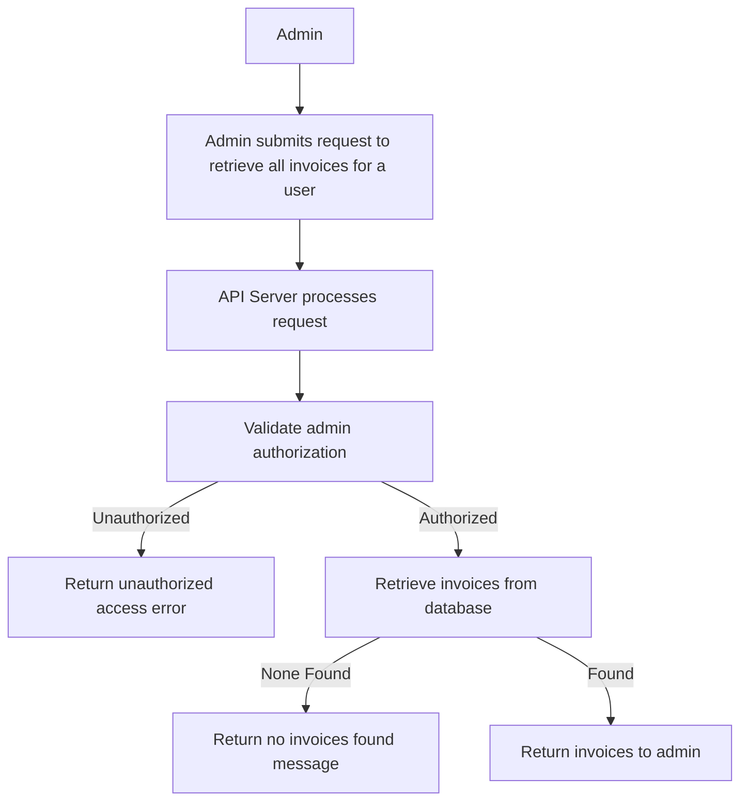
```mermaid
graph TD;
    Admin-->Submit_Get_All_Invoices_Request[Admin submits request to retrieve all invoices for a user];
    Submit_Get_All_Invoices_Request-->API_Server[API Server processes request];
    API_Server-->Validate_Admin[Validate admin authorization];
    Validate_Admin-->|Unauthorized|Return_Error[Return unauthorized access error];
    Validate_Admin-->|Authorized|Retrieve_Invoices[Retrieve invoices from database];
    Retrieve_Invoices-->|None Found|Return_Not_Found[Return no invoices found message];
    Retrieve_Invoices-->|Found|Return_Success[Return invoices to admin];
```

- **Explanation**:
  - The admin submits a request to retrieve all invoices for a specific user.
  - The server validates that the requester has admin privileges.
  - If the requester is authorized, the server retrieves all invoices associated with the specified user from the database.
  - The server returns the list of invoices to the admin or an appropriate error message if no invoices are found or if the requester is unauthorized.

#### Decision Log

- **Role-Based Access Control**: The decision to restrict this endpoint to admin users ensures that sensitive billing information is only accessible to authorized personnel.
- **Detailed Invoice Retrieval**: Each invoice is retrieved with all related information, providing a comprehensive view for administrative purposes.
- **Error Handling**: The system logs and handles errors, such as unauthorized access attempts or the absence of invoices, ensuring that admins are informed of any issues.

#### Endpoints and API Documentation

#### Endpoint Description

This endpoint allows administrators to retrieve all invoices associated with a specific user. The invoices returned include detailed information about each invoice, allowing admins to review and manage user billing records.

#### URL

`GET /api/v{version}/Invoice/get-all-invoice/{id}`

#### HTTP Method

`GET`

#### Request Headers

- **Authorization**: `Bearer {token}` (required)

#### Request Body

- **None**: This is a GET request, so the user ID is passed directly in the URL.

#### Response

- **Success (200 OK)**

```json
{
	"isSuccess": true,
	"message": "Invoices successfully returned",
	"result": [
		{
			"id": "invoice-id-12345",
			"frontendId": "invoice-frontend-id-12345",
			"createdAt": "2024-07-01T12:00:00Z",
			"paymentDue": "2024-07-31T12:00:00Z",
			"description": "Consulting services for July 2024",
			"paymentTerms": 30,
			"clientName": "ABC Corp",
			"clientEmail": "client@abccorp.com",
			"status": "Pending",
			"senderAddress": {
				"street": "123 Main St",
				"city": "Metropolis",
				"postCode": "12345",
				"country": "USA"
			},
			"clientAddress": {
				"street": "456 Elm St",
				"city": "Gotham",
				"postCode": "67890",
				"country": "USA"
			},
			"total": 1500.0,
			"items": [
				{
					"name": "Consulting Fee",
					"quantity": 10,
					"price": 150.0,
					"total": 1500.0
				}
			]
		}
	]
}
```

- **isSuccess**: Indicates whether the request to retrieve invoices was successful.
- **message**: A message confirming that the invoices were successfully retrieved.
- **result**: An array of invoices, each with detailed information, including client details, items, payment terms, and the total amount.

- **Error (403 Forbidden)**

```json
{
	"isSuccess": false,
	"message": "Unauthorized to perform this action",
	"result": null
}
```

- **isSuccess**: Indicates that the request to retrieve invoices failed due to lack of authorization.
- **message**: A message explaining that the requester is not authorized to perform this action.

- **Error (500 Internal Server Error)**

```json
{
	"isSuccess": false,
	"message": "An error occurred while retrieving the invoices.",
	"result": null
}
```

- **isSuccess**: Indicates that the request to retrieve invoices failed due to a server-side error.
- **message**: A message explaining that an internal error occurred during the retrieval process.

#### Roles and Permissions

- **Admin Access**: This endpoint is restricted to users with the "Admin" role.
- **Security Logging**: All access attempts and invoice retrievals are logged for security and auditing purposes.

---

### Feature Name: Get All Invoices for a User

#### Feature Overview

The **Get All Invoices for a User** feature allows authenticated users to retrieve a comprehensive list of all invoices associated with their account. This feature is crucial for users who need to manage their billing history, review past transactions, and keep track of pending payments. The retrieved data includes detailed information for each invoice, such as client details, payment terms, items, and the total amount due. This functionality provides users with a clear overview of their invoicing activities.

#### User Stories

- **As a user**, I want to retrieve all invoices associated with my account so that I can manage and review my billing history.
- **As a user**, I want to see detailed information about each invoice to ensure that all billing entries are accurate and complete.
- **As a system auditor**, I need to ensure that users can only access their invoices to maintain data security and privacy.

#### Flow Diagram

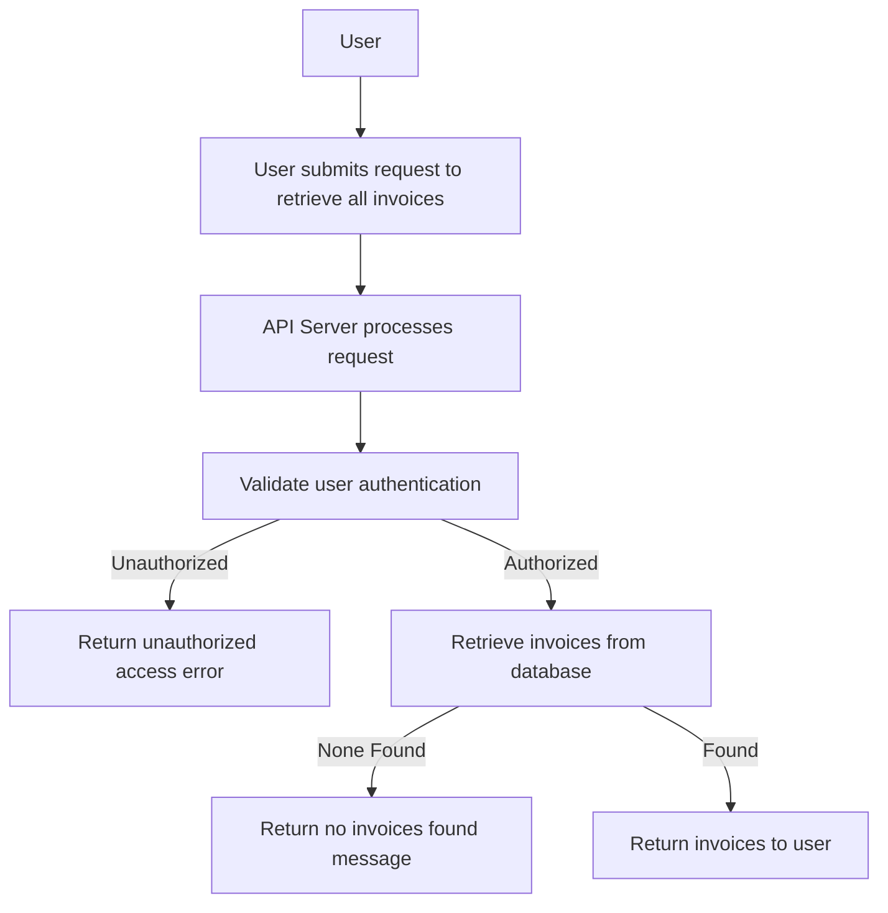
```mermaid
graph TD;
    User-->Submit_Get_All_Invoices_Request[User submits request to retrieve all invoices];
    Submit_Get_All_Invoices_Request-->API_Server[API Server processes request];
    API_Server-->Validate_User[Validate user authentication];
    Validate_User-->|Unauthorized|Return_Error[Return unauthorized access error];
    Validate_User-->|Authorized|Retrieve_Invoices[Retrieve invoices from database];
    Retrieve_Invoices-->|None Found|Return_Not_Found[Return no invoices found message];
    Retrieve_Invoices-->|Found|Return_Success[Return invoices to user];
```

- **Explanation**:
  - The user submits a request to retrieve all invoices associated with their account.
  - The server validates the user’s authentication to ensure they are authorized to access the requested data.
  - If the user is authorized, the server retrieves all invoices from the database that belong to the user.
  - The retrieved invoices are mapped to response DTOs, which include all relevant details.
  - The server returns the list of invoices to the user or an appropriate error message if no invoices are found or if the user is unauthorized.

#### Decision Log

- **User-Specific Data Access**: The decision to restrict invoice retrieval to only the authenticated user's data ensures privacy and security.
- **Comprehensive Invoice Retrieval**: Each invoice is retrieved with all related information, providing a full view for the user to manage their billing records.
- **Error Handling**: The system logs and handles errors, such as unauthorized access attempts or the absence of invoices, ensuring that users are informed of any issues.

#### Endpoints and API Documentation

#### Endpoint Description

This endpoint allows authenticated users to retrieve all invoices associated with their account. The invoices returned include detailed information about each invoice, enabling users to review and manage their billing history effectively.

#### URL

`GET /api/v{version}/Invoice/get-all-invoice`

#### HTTP Method

`GET`

#### Request Headers

- **Authorization**: `Bearer {token}` (required)

#### Request Body

- **None**: This is a GET request, so no request body is needed.

#### Response

- **Success (200 OK)**

```json
{
	"isSuccess": true,
	"message": "Invoices successfully returned",
	"result": [
		{
			"id": "invoice-id-12345",
			"frontendId": "invoice-frontend-id-12345",
			"createdAt": "2024-07-01T12:00:00Z",
			"paymentDue": "2024-07-31T12:00:00Z",
			"description": "Consulting services for July 2024",
			"paymentTerms": 30,
			"clientName": "ABC Corp",
			"clientEmail": "client@abccorp.com",
			"status": "Pending",
			"senderAddress": {
				"street": "123 Main St",
				"city": "Metropolis",
				"postCode": "12345",
				"country": "USA"
			},
			"clientAddress": {
				"street": "456 Elm St",
				"city": "Gotham",
				"postCode": "67890",
				"country": "USA"
			},
			"total": 1500.0,
			"items": [
				{
					"name": "Consulting Fee",
					"quantity": 10,
					"price": 150.0,
					"total": 1500.0
				}
			]
		}
	]
}
```

- **isSuccess**: Indicates whether the request to retrieve invoices was successful.
- **message**: A message confirming that the invoices were successfully retrieved.
- **result**: An array of invoices, each with detailed information, including client details, items, payment terms, and the total amount.

- **Error (403 Forbidden)**

```json
{
	"isSuccess": false,
	"message": "Unauthorized to perform this action",
	"result": null
}
```

- **isSuccess**: Indicates that the request to retrieve invoices failed due to lack of authorization.
- **message**: A message explaining that the requester is not authorized to perform this action.

- **Error (500 Internal Server Error)**

```json
{
	"isSuccess": false,
	"message": "An error occurred while retrieving the invoices.",
	"result": null
}
```

- **isSuccess**: Indicates that the request to retrieve invoices failed due to a server-side error.
- **message**: A message explaining that an internal error occurred during the retrieval process.

#### Roles and Permissions

- **Authenticated User Access**: This endpoint is accessible to all authenticated users, allowing them to retrieve only their invoices.
- **Security Logging**: All access attempts and invoice retrievals are logged for security and auditing purposes.

---

### Feature Name: Get All Invoices for a User with Pagination

#### Feature Overview

The **Get All Invoices for a User with Pagination** feature allows authenticated users to retrieve their invoices in a paginated format. This is particularly useful when a user has a large number of invoices, enabling them to access their data in manageable chunks. The feature provides detailed information for each invoice, such as client details, payment terms, items, and the total amount due, with the ability to navigate through the data page by page. Pagination enhances performance and user experience by preventing the overload of data and ensuring quicker response times.

#### User Stories

- **As a user**, I want to retrieve my invoices in a paginated format so that I can easily browse through them without being overwhelmed by too much data at once.
- **As a user**, I want to see all relevant details of my invoices within each page to ensure I have a comprehensive understanding of my billing history.
- **As a developer**, I want to implement efficient data retrieval using pagination to optimize the system's performance when dealing with large volumes of data.

#### Flow Diagram

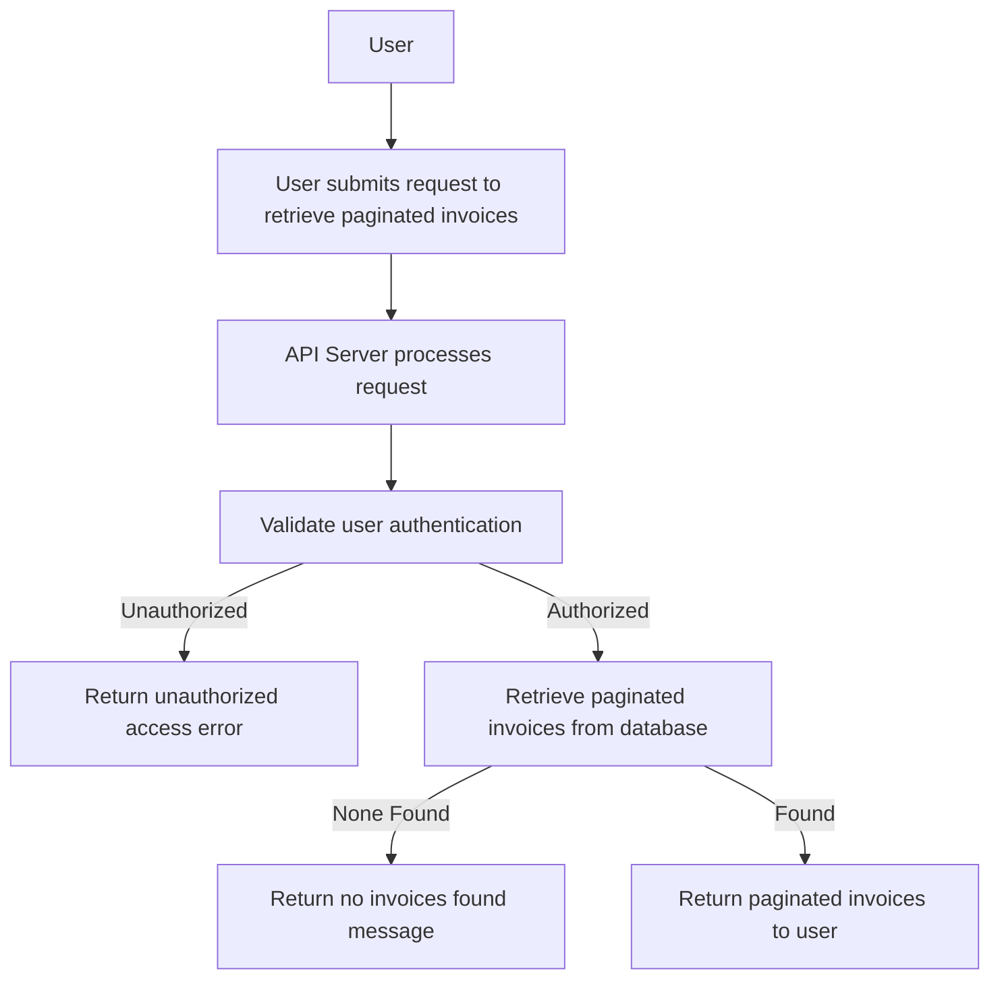
```mermaid
graph TD;
    User-->Submit_Paginated_Invoice_Request[User submits request to retrieve paginated invoices];
    Submit_Paginated_Invoice_Request-->API_Server[API Server processes request];
    API_Server-->Validate_User[Validate user authentication];
    Validate_User-->|Unauthorized|Return_Error[Return unauthorized access error];
    Validate_User-->|Authorized|Retrieve_Paginated_Invoices[Retrieve paginated invoices from database];
    Retrieve_Paginated_Invoices-->|None Found|Return_Not_Found[Return no invoices found message];
    Retrieve_Paginated_Invoices-->|Found|Return_Success[Return paginated invoices to user];
```

- **Explanation**:
  - The user submits a request to retrieve invoices in a paginated format.
  - The server validates the user’s authentication to ensure they are authorized to access the requested data.
  - If the user is authorized, the server retrieves invoices from the database, applying pagination based on the provided parameters.
  - The retrieved invoices are mapped to response DTOs, which include all relevant details.
  - The server returns the paginated list of invoices to the user or an appropriate error message if no invoices are found or if the user is unauthorized.

#### Decision Log

- **Pagination Implementation**: The decision to implement pagination ensures that the system can handle large datasets efficiently without compromising performance.
- **User-Specific Data Access**: The feature ensures that users only retrieve their invoices, maintaining data security and privacy.
- **Error Handling**: The system includes robust error handling to manage scenarios where no invoices are found or the user is unauthorized to access the data.

#### Endpoints and API Documentation

#### Endpoint Description

This endpoint allows authenticated users to retrieve a paginated list of invoices associated with their account. Pagination parameters are used to control the number of invoices returned per page and the specific page of results requested.

#### URL

`GET /api/v{version}/Invoice/get-all-invoice-paginatation`

#### HTTP Method

`GET`

#### Request Headers

- **Authorization**: `Bearer {token}` (required)

#### Request Body

- **None**: This is a GET request. Pagination parameters are passed via query parameters.

#### Query Parameters

- **pageNumber**: The page number to retrieve (default is 1).
- **pageSize**: The number of invoices per page (default is 10).

#### Response

- **Success (200 OK)**

```json
{
	"isSuccess": true,
	"message": "Invoices retrieved successfully.",
	"result": {
		"pageNumber": 1,
		"totalPages": 5,
		"totalItems": 50,
		"hasPreviousPage": false,
		"hasNextPage": true,
		"items": [
			{
				"id": "invoice-id-12345",
				"frontendId": "invoice-frontend-id-12345",
				"createdAt": "2024-07-01T12:00:00Z",
				"paymentDue": "2024-07-31T12:00:00Z",
				"description": "Consulting services for July 2024",
				"paymentTerms": 30,
				"clientName": "ABC Corp",
				"clientEmail": "client@abccorp.com",
				"status": "Pending",
				"senderAddress": {
					"street": "123 Main St",
					"city": "Metropolis",
					"postCode": "12345",
					"country": "USA"
				},
				"clientAddress": {
					"street": "456 Elm St",
					"city": "Gotham",
					"postCode": "67890",
					"country": "USA"
				},
				"total": 1500.0,
				"items": [
					{
						"name": "Consulting Fee",
						"quantity": 10,
						"price": 150.0,
						"total": 1500.0
					}
				]
			}
		]
	}
}
```

- **isSuccess**: Indicates whether the request to retrieve paginated invoices was successful.
- **message**: A message confirming that the invoices were successfully retrieved.
- **result**: An object containing pagination details (page number, total pages, total items, etc.) and the list of invoices for the requested page.

- **Error (403 Forbidden)**

```json
{
	"isSuccess": false,
	"message": "Unauthorized to perform this action",
	"result": null
}
```

- **isSuccess**: Indicates that the request to retrieve invoices failed due to lack of authorization.
- **message**: A message explaining that the requester is not authorized to perform this action.

- **Error (500 Internal Server Error)**

```json
{
	"isSuccess": false,
	"message": "An error occurred while retrieving the invoices.",
	"result": null
}
```

- **isSuccess**: Indicates that the request to retrieve invoices failed due to a server-side error.
- **message**: A message explaining that an internal error occurred during the retrieval process.

#### Roles and Permissions

- **Authenticated User Access**: This endpoint is accessible to all authenticated users, allowing them to retrieve only their invoices with pagination.
- **Security Logging**: All access attempts and invoice retrievals are logged for security and auditing purposes.

---

### Feature Name: Edit Invoice

#### Feature Overview

The **Edit Invoice** feature allows authenticated users to update the details of an existing invoice, provided the invoice is not in a "Paid" or "Pending" status. This feature is crucial for users who need to make corrections or adjustments to an invoice after its creation but before it is finalized and sent to the client. Users can update the invoice description, payment terms, client information, and the list of items. The feature ensures that once an invoice is marked as "Paid" or "Pending," it cannot be edited, maintaining the integrity of completed transactions.

#### User Stories

- **As a user**, I want to be able to edit my draft invoices to correct any errors or update details before sending them to clients.
- **As a user**, I want to ensure that invoices that have been marked as "Paid" or "Pending" cannot be edited to prevent discrepancies in my billing records.
- **As a developer**, I want to ensure that the system prevents editing of invoices that are in a non-editable state to maintain data consistency and integrity.

#### Flow Diagram

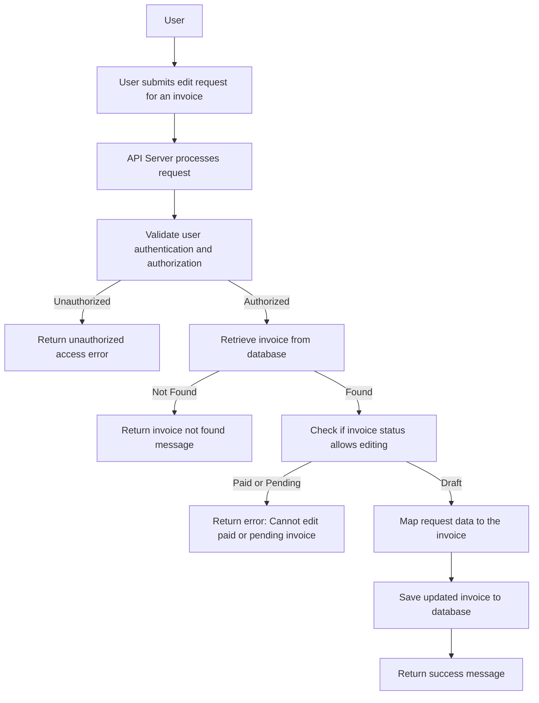
```mermaid
graph TD;
    User-->Submit_Edit_Request[User submits edit request for an invoice];
    Submit_Edit_Request-->API_Server[API Server processes request];
    API_Server-->Validate_User[Validate user authentication and authorization];
    Validate_User-->|Unauthorized|Return_Error[Return unauthorized access error];
    Validate_User-->|Authorized|Retrieve_Invoice[Retrieve invoice from database];
    Retrieve_Invoice-->|Not Found|Return_Not_Found[Return invoice not found message];
    Retrieve_Invoice-->|Found|Check_Invoice_Status[Check if invoice status allows editing];
    Check_Invoice_Status-->|Paid or Pending|Return_Cannot_Edit[Return error: Cannot edit paid or pending invoice];
    Check_Invoice_Status-->|Draft|Map_Changes[Map request data to the invoice];
    Map_Changes-->Save_Changes[Save updated invoice to database];
    Save_Changes-->Return_Success[Return success message];
```

- **Explanation**:
  - The user submits a request to edit an invoice.
  - The server validates the user’s authentication and authorization.
  - If the user is authorized, the server retrieves the invoice from the database.
  - The server checks if the invoice is in a status that allows editing ("Draft").
  - If the invoice is "Paid" or "Pending," an error message is returned, indicating that the invoice cannot be edited.
  - If the invoice is in "Draft" status, the server maps the changes from the request to the invoice and saves the updated invoice to the database.
  - A success message is returned to the user.

#### Decision Log

- **Immutable Invoices**: The decision to prevent editing of "Paid" and "Pending" invoices ensures the integrity of finalized transactions and prevents unauthorized changes to completed billing records.
- **Draft Editing**: Allowing edits to invoices in "Draft" status provides flexibility for users to make necessary corrections before finalizing an invoice.
- **Error Handling**: The system logs and returns specific error messages for scenarios where an invoice cannot be edited, ensuring clarity for users and maintaining system integrity.

#### Endpoints and API Documentation

#### Endpoint Description

This endpoint allows authenticated users to edit an existing invoice, provided the invoice is in "Draft" status. Users can update the invoice details, including the description, payment terms, client information, and items.

#### URL

`PUT /api/v{version}/Invoice/edit/{id}`

#### HTTP Method

`PUT`

#### Request Headers

- **Authorization**: `Bearer {token}` (required)

#### Request Body

- **InvoiceRequestDto**: Contains the details to be updated in the invoice.

```json
{
	"description": "Updated consulting services for July 2024",
	"paymentTerms": 30,
	"clientName": "XYZ Corp",
	"clientEmail": "client@xyzcorp.com",
	"isReady": true,
	"senderAddress": {
		"street": "123 Main St",
		"city": "Metropolis",
		"postCode": "12345",
		"country": "USA"
	},
	"clientAddress": {
		"street": "456 Elm St",
		"city": "Gotham",
		"postCode": "67890",
		"country": "USA"
	},
	"items": [
		{
			"name": "Consulting Fee",
			"quantity": 15,
			"price": 150.0,
			"total": 2250.0
		}
	]
}
```

#### Response

- **Success (200 OK)**

```json
{
	"isSuccess": true,
	"message": "Invoice updated successfully.",
	"result": true
}
```

- **isSuccess**: Indicates whether the request to edit the invoice was successful.
- **message**: A message confirming that the invoice was successfully updated.
- **result**: Boolean indicating the success of the operation.

- **Error (400 Bad Request)**

```json
{
	"isSuccess": false,
	"message": "Paid invoices cannot be edited.",
	"result": false
}
```

- **isSuccess**: Indicates that the request to edit the invoice failed because the invoice is in a "Paid" status.
- **message**: A message explaining that paid invoices cannot be edited.
- **result**: Boolean indicating the failure of the operation.

- **Error (404 Not Found)**

```json
{
	"isSuccess": false,
	"message": "Invoice not found.",
	"result": false
}
```

- **isSuccess**: Indicates that the request to edit the invoice failed because the invoice was not found.
- **message**: A message explaining that the invoice does not exist.
- **result**: Boolean indicating the failure of the operation.

#### Roles and Permissions

- **Authenticated User Access**: This endpoint is accessible to all authenticated users, allowing them to edit only their invoices that are in "Draft" status.
- **Security Logging**: All access attempts and invoice edits are logged for security and auditing purposes.

---

### Feature Name: Delete Invoice by ID

#### Feature Overview

The **Delete Invoice by ID** feature allows authenticated users to delete an invoice from the system. This operation can only be performed by the user who created the invoice, ensuring that unauthorized users cannot delete invoices that do not belong to them. The feature also includes logic to clean up related data, such as associated addresses and recurring invoices, if they are no longer referenced by any other invoices. This ensures that the system remains clean and free of orphaned data.

#### User Stories

- **As a user**, I want to delete invoices that I no longer need to keep my billing records organized and up-to-date.
- **As a user**, I want to ensure that when I delete an invoice, all related data (e.g., recurring invoices, addresses) is appropriately cleaned up or preserved if still in use.
- **As a developer**, I want to prevent unauthorized users from deleting invoices to maintain data security and integrity.

#### Flow Diagram

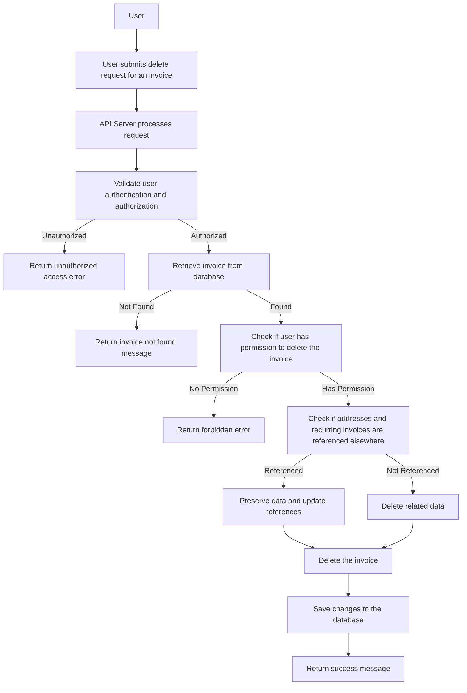
```mermaid
graph TD;
    User-->Submit_Delete_Request[User submits delete request for an invoice];
    Submit_Delete_Request-->API_Server[API Server processes request];
    API_Server-->Validate_User[Validate user authentication and authorization];
    Validate_User-->|Unauthorized|Return_Error[Return unauthorized access error];
    Validate_User-->|Authorized|Retrieve_Invoice[Retrieve invoice from database];
    Retrieve_Invoice-->|Not Found|Return_Not_Found[Return invoice not found message];
    Retrieve_Invoice-->|Found|Check_User_Permission[Check if user has permission to delete the invoice];
    Check_User_Permission-->|No Permission|Return_Forbidden[Return forbidden error];
    Check_User_Permission-->|Has Permission|Check_References[Check if addresses and recurring invoices are referenced elsewhere];
    Check_References-->|Referenced|Preserve_Data[Preserve data and update references];
    Check_References-->|Not Referenced|Delete_Related_Data[Delete related data];
    Preserve_Data-->Delete_Invoice[Delete the invoice];
    Delete_Related_Data-->Delete_Invoice;
    Delete_Invoice-->Save_Changes[Save changes to the database];
    Save_Changes-->Return_Success[Return success message];
```

- **Explanation**:
  - The user submits a request to delete an invoice.
  - The server validates the user’s authentication and authorization.
  - If the user is authorized, the server retrieves the invoice from the database.
  - The server checks if the user has permission to delete the invoice.
  - If the invoice is found and the user has permission, the server checks if any related addresses or recurring invoices are still referenced by other invoices.
  - If related data is referenced, the server preserves the data and updates references; otherwise, it deletes the related data.
  - The server deletes the invoice and saves the changes to the database.
  - A success message is returned to the user.

#### Decision Log

- **Data Integrity**: The decision to check references before deleting related data ensures that no orphaned data is left in the system, maintaining data integrity.
- **Authorization Check**: The decision to allow only the creator of the invoice to delete it ensures that unauthorized users cannot alter or remove data they do not own.
- **Error Handling**: The system includes robust error handling to manage scenarios where an invoice cannot be found or the user is unauthorized to delete it.

#### Endpoints and API Documentation

#### Endpoint Description

This endpoint allows authenticated users to delete an existing invoice, provided they are the original creator of the invoice. The endpoint also handles the deletion of related data, such as addresses and recurring invoices, if they are no longer in use.

#### URL

`DELETE /api/v{version}/Invoice/{id}`

#### HTTP Method

`DELETE`

#### Request Headers

- **Authorization**: `Bearer {token}` (required)

#### Request Body

- **None**: This is a DELETE request, and no body is required.

#### Response

- **Success (200 OK)**

```json
{
	"isSuccess": true,
	"message": "Invoice deleted successfully",
	"result": true
}
```

- **isSuccess**: Indicates whether the request to delete the invoice was successful.
- **message**: A message confirming that the invoice was successfully deleted.
- **result**: Boolean indicating the success of the operation.

- **Error (404 Not Found)**

```json
{
	"isSuccess": false,
	"message": "Invoice not found",
	"result": false
}
```

- **isSuccess**: Indicates that the request to delete the invoice failed because the invoice was not found.
- **message**: A message explaining that the invoice does not exist.
- **result**: Boolean indicating the failure of the operation.

- **Error (403 Forbidden)**

```json
{
	"isSuccess": false,
	"message": "Unauthorized to delete this invoice",
	"result": false
}
```

- **isSuccess**: Indicates that the request to delete the invoice failed due to lack of permission.
- **message**: A message explaining that the user is not authorized to delete the invoice.
- **result**: Boolean indicating the failure of the operation.

- **Error (500 Internal Server Error)**

```json
{
	"isSuccess": false,
	"message": "An error occurred while deleting the invoice.",
	"result": false
}
```

- **isSuccess**: Indicates that the request to delete the invoice failed due to a server-side error.
- **message**: A message explaining that an internal error occurred during the deletion process.
- **result**: Boolean indicating the failure of the operation.

#### Roles and Permissions

- **Authenticated User Access**: This endpoint is accessible to all authenticated users, but they can only delete invoices that they have created.
- **Security Logging**: All access attempts and invoice deletions are logged for security and auditing purposes.

---

### Feature Name: Mark an Invoice as Paid

#### Feature Overview

The **Mark an Invoice as Paid** feature allows authenticated users to update the status of an invoice to "Paid." This feature is critical for ensuring accurate financial records and tracking invoice payments. Users can only mark an invoice as paid if it is in the "Pending" status; invoices in the "Draft" or "Paid" statuses cannot be marked as paid again. This feature helps maintain the integrity of invoice statuses and ensures that payment records are updated correctly.

#### User Stories

- **As a user**, I want to mark an invoice as paid so that I can keep my financial records up-to-date.
- **As a user**, I should not be able to mark an invoice as paid if it is still in the draft stage to avoid premature payment status changes.
- **As a user**, I want to receive confirmation that my action to mark an invoice as paid was successful.

#### Flow Diagram

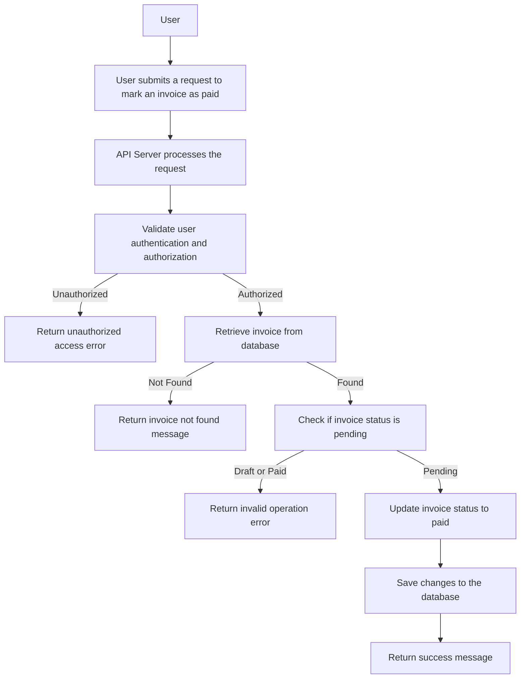
```mermaid
graph TD;
    User-->Submit_Mark_As_Paid_Request[User submits a request to mark an invoice as paid];
    Submit_Mark_As_Paid_Request-->API_Server[API Server processes the request];
    API_Server-->Validate_User[Validate user authentication and authorization];
    Validate_User-->|Unauthorized|Return_Error[Return unauthorized access error];
    Validate_User-->|Authorized|Retrieve_Invoice[Retrieve invoice from database];
    Retrieve_Invoice-->|Not Found|Return_Not_Found[Return invoice not found message];
    Retrieve_Invoice-->|Found|Check_Invoice_Status[Check if invoice status is pending];
    Check_Invoice_Status-->|Draft or Paid|Return_Invalid_Operation[Return invalid operation error];
    Check_Invoice_Status-->|Pending|Update_Status_To_Paid[Update invoice status to paid];
    Update_Status_To_Paid-->Save_Changes[Save changes to the database];
    Save_Changes-->Return_Success[Return success message];
```

- **Explanation**:
  - The user submits a request to mark an invoice as paid.
  - The server validates the user’s authentication and authorization.
  - If the user is authorized, the server retrieves the invoice from the database.
  - The server checks if the invoice status is "Pending."
  - If the invoice status is "Draft" or "Paid," an error is returned.
  - If the invoice status is "Pending," the server updates the status to "Paid" and saves the changes.
  - A success message is returned to the user.

#### Decision Log

- **Status Integrity**: The decision to restrict status changes ensures that only invoices in the correct state ("Pending") can be marked as paid, preventing erroneous or premature status changes.
- **Error Handling**: Comprehensive error handling is implemented to manage cases where an invoice cannot be found or is in an inappropriate status for marking as paid.

#### Endpoints and API Documentation

#### Endpoint Description

This endpoint allows authenticated users to mark an existing invoice as paid, provided the invoice is currently in the "Pending" status. The endpoint updates the invoice status and returns a confirmation of the operation.

#### URL

`POST /api/v{version}/Invoice/{invoiceId}/mark-as-paid`

#### HTTP Method

`POST`

#### Request Headers

- **Authorization**: `Bearer {token}` (required)

#### Request Body

- **None**: This is a POST request, but no body is required as the action is specified by the endpoint URL.

#### Response

- **Success (200 OK)**

```json
{
	"isSuccess": true,
	"message": "Invoice marked as paid successfully.",
	"result": true
}
```

- **isSuccess**: Indicates whether the request to mark the invoice as paid was successful.
- **message**: A message confirming that the invoice was successfully marked as paid.
- **result**: Boolean indicating the success of the operation.

- **Error (404 Not Found)**

```json
{
	"isSuccess": false,
	"message": "Invoice not found.",
	"result": false
}
```

- **isSuccess**: Indicates that the request to mark the invoice as paid failed because the invoice was not found.
- **message**: A message explaining that the invoice does not exist.
- **result**: Boolean indicating the failure of the operation.

- **Error (400 Bad Request)**

```json
{
	"isSuccess": false,
	"message": "Invalid Operation.",
	"result": false
}
```

- **isSuccess**: Indicates that the request to mark the invoice as paid failed because the invoice is in an inappropriate status (e.g., Draft or already Paid).
- **message**: A message explaining why the operation is invalid.
- **result**: Boolean indicating the failure of the operation.

- **Error (500 Internal Server Error)**

```json
{
	"isSuccess": false,
	"message": "An error occurred while marking the invoice as paid.",
	"result": false
}
```

- **isSuccess**: Indicates that the request to mark the invoice as paid failed due to a server-side error.
- **message**: A message explaining that an internal error occurred during the process.
- **result**: Boolean indicating the failure of the operation.

#### Roles and Permissions

- **Authenticated User Access**: This endpoint is accessible to all authenticated users, but they can only mark invoices as paid that they have created.
- **Security Logging**: All access attempts and invoice status changes are logged for security and auditing purposes.

---

### Feature Name: Mark an Invoice as Pending

#### Feature Overview

The **Mark an Invoice as Pending** feature allows authenticated users to update the status of an invoice to "Pending." This is useful when an invoice, initially marked as a "Draft," is ready to be processed and moved into a pending state, awaiting payment. However, invoices that have already been marked as "Paid" cannot be reverted to a "Pending" status, ensuring the integrity of the payment status.

#### User Stories

- **As a user**, I want to mark my draft invoice as pending when it is ready to be processed, so that it can be tracked and paid.
- **As a user**, I should not be able to change the status of an invoice from "Paid" back to "Pending" to maintain accurate financial records.
- **As a user**, I want to receive a confirmation that my invoice has been successfully marked as pending.

#### Flow Diagram

```mermaid
graph TD;
    User-->Submit_Mark_As_Pending_Request[User submits a request to mark an invoice as pending];
    Submit_Mark_As_Pending_Request-->API_Server[API Server processes the request];
    API_Server-->Validate_User[Validate user authentication and authorization];
    Validate_User-->|Unauthorized|Return_Error[Return unauthorized access error];
    Validate_User-->|Authorized|Retrieve_Invoice[Retrieve invoice from database];
    Retrieve_Invoice-->|Not Found|Return_Not_Found[Return invoice not found message];
    Retrieve_Invoice-->|Found|Check_Invoice_Status[Check current invoice status];
    Check_Invoice_Status-->|Paid|Return_Invalid_Operation[Return invalid operation error];
    Check_Invoice_Status-->|Pending|Return_Already_Pending[Return already pending message];
    Check_Invoice_Status-->|Draft|Update_Status_To_Pending[Update invoice status to pending];
    Update_Status_To_Pending-->Save_Changes[Save changes to the database];
    Save_Changes-->Return_Success[Return success message];
```

- **Explanation**:
  - The user submits a request to mark an invoice as pending.
  - The server validates the user’s authentication and authorization.
  - If the user is authorized, the server retrieves the invoice from the database.
  - The server checks the current status of the invoice.
  - If the invoice is already marked as "Paid," an error is returned.
  - If the invoice is already "Pending," an appropriate message is returned.
  - If the invoice is a "Draft," the server updates the status to "Pending" and saves the changes.
  - A success message is returned to the user.

#### Decision Log

- **Status Integrity**: The decision to restrict status changes from "Paid" back to "Pending" ensures that once a payment is confirmed, it cannot be undone, preserving the accuracy of financial records.
- **Error Handling**: The system provides clear feedback when an attempt is made to change the status of an invoice that is already in the desired state or cannot be changed due to its current status.

#### Endpoints and API Documentation

#### Endpoint Description

This endpoint allows authenticated users to mark an existing draft invoice as pending, provided the invoice is currently in the "Draft" status. The endpoint updates the invoice status and returns a confirmation of the operation.

#### URL

`POST /api/v{version}/Invoice/{invoiceId}/mark-as-pending`

#### HTTP Method

`POST`

#### Request Headers

- **Authorization**: `Bearer {token}` (required)

#### Request Body

- **None**: This is a POST request, but no body is required as the action is specified by the endpoint URL.

#### Response

- **Success (200 OK)**

```json
{
	"isSuccess": true,
	"message": "Invoice marked as pending successfully.",
	"result": true
}
```

- **isSuccess**: Indicates whether the request to mark the invoice as pending was successful.
- **message**: A message confirming that the invoice was successfully marked as pending.
- **result**: Boolean indicating the success of the operation.

- **Error (404 Not Found)**

```json
{
	"isSuccess": false,
	"message": "Invoice not found.",
	"result": false
}
```

- **isSuccess**: Indicates that the request to mark the invoice as pending failed because the invoice was not found.
- **message**: A message explaining that the invoice does not exist.
- **result**: Boolean indicating the failure of the operation.

- **Error (400 Bad Request)**

```json
{
	"isSuccess": false,
	"message": "Invalid Operation.",
	"result": false
}
```

- **isSuccess**: Indicates that the request to mark the invoice as pending failed because the invoice is in an inappropriate status (e.g., already marked as Paid).
- **message**: A message explaining why the operation is invalid.
- **result**: Boolean indicating the failure of the operation.

- **Error (500 Internal Server Error)**

```json
{
	"isSuccess": false,
	"message": "An error occurred while marking the invoice as pending.",
	"result": false
}
```

- **isSuccess**: Indicates that the request to mark the invoice as pending failed due to a server-side error.
- **message**: A message explaining that an internal error occurred during the process.
- **result**: Boolean indicating the failure of the operation.

#### Roles and Permissions

- **Authenticated User Access**: This endpoint is accessible to all authenticated users, but they can only mark invoices they have created as pending.
- **Security Logging**: All access attempts and invoice status changes are logged for security and auditing purposes.

---

### Feature Name: Generate Recurring Invoices

#### Feature Overview

The **Generate Recurring Invoices** feature allows the system to automatically generate new invoices based on existing recurring invoice templates. This feature is intended to simplify the process of handling recurring payments, ensuring that invoices are generated consistently according to a predefined schedule. The feature runs daily and checks for invoices that are due to recur on that day, creating new invoices accordingly.

#### User Stories

- **As an admin**, I want the system to automatically generate recurring invoices based on a schedule, so that I do not have to manually create invoices for recurring payments.
- **As a business owner**, I want recurring invoices to be generated with the same details as the original invoice, including client information and payment terms, to ensure consistency and accuracy.
- **As an admin**, I want the ability to review generated recurring invoices to ensure that they have been created correctly.

#### Flow Diagram

```mermaid
graph TD;
    Start[Start Recurring Invoice Generation] --> Check_Invoices[Check for invoices due to recur today];
    Check_Invoices --> Retrieve_Invoices[Retrieve invoices with today's recurrence date];
    Retrieve_Invoices --> For_Each_Invoice{For each invoice};
    For_Each_Invoice --> Check_Existing{Check if recurring invoice already exists for today};
    Check_Existing -->|Yes| Skip_Invoice[Skip to next invoice];
    Check_Existing -->|No| Generate_Invoice[Generate new invoice based on recurring template];
    Generate_Invoice --> Save_Invoice[Save new invoice to database];
    Save_Invoice --> Log_Success[Log success message];
    Log_Success --> Update_Recurrence[Update recurrence count for the original invoice];
    Update_Recurrence --> Save_Changes[Save changes to database];
    Save_Changes --> End[End Process];
    Skip_Invoice --> End;
```

- **Explanation**:
  - The system starts the recurring invoice generation process by checking for invoices that are due to recur today.
  - For each eligible invoice, the system checks if a recurring invoice has already been generated for today.
  - If no existing invoice is found, a new invoice is generated based on the recurring template, and the recurrence count is updated.
  - The process repeats for all eligible invoices and logs the success or failure of each operation.

#### Decision Log

- **Duplicate Prevention**: The system ensures that a recurring invoice is not generated multiple times for the same day by checking if an invoice for that day already exists.
- **Error Handling**: The system includes robust error handling to ensure that any issues encountered during invoice generation are logged, and the transaction is rolled back to maintain data integrity.

#### Endpoints and API Documentation

#### Endpoint Description

This endpoint allows an authorized admin to trigger the generation of recurring invoices. The endpoint identifies invoices that are scheduled to recur on the current day and generates new invoices accordingly.

#### URL

`POST /api/v{version}/Invoice/generate-recurring-invoices`

#### HTTP Method

`POST`

#### Request Headers

- **Authorization**: `Bearer {token}` (required)

#### Request Body

- **None**: This endpoint does not require a request body as it operates on the server's date to determine which invoices to generate.

#### Response

- **Success (200 OK)**

```json
{
	"isSuccess": true,
	"message": "Recurring invoices generated successfully.",
	"result": true
}
```

- **isSuccess**: Indicates whether the recurring invoices were successfully generated.
- **message**: A message confirming that the recurring invoices were generated.
- **result**: Boolean indicating the success of the operation.

- **Error (500 Internal Server Error)**

```json
{
	"isSuccess": false,
	"message": "An error occurred: {ex.Message}",
	"result": false
}
```

- **isSuccess**: Indicates that the generation of recurring invoices failed due to a server-side error.
- **message**: A message explaining the error that occurred.
- **result**: Boolean indicating the failure of the operation.

#### Roles and Permissions

- **Admin Access**: Only users with the "Admin" role are authorized to access this endpoint and trigger the generation of recurring invoices.
- **Security Logging**: All access to this endpoint and the resulting operations are logged for security and auditing purposes.

---

### Feature Name: Create Swagger Credentials

#### Feature Overview

The **Create Swagger Credentials** feature allows users to generate temporary access credentials for the Swagger documentation. These credentials include a username, password, and an expiration time of 24 hours. The generated credentials are displayed only once and cannot be retrieved again after they are generated. This feature is designed to provide secure, time-limited access to the Swagger API documentation for testing purposes.

#### User Stories

- **As a user**, I want to generate temporary Swagger credentials that expire after 24 hours so that I can securely test the API using the Swagger documentation.
- **As a developer**, I want to receive the generated credentials immediately upon request and understand that they cannot be retrieved again to ensure security.
- **As a security-conscious user**, I want the credentials to be time-limited and stored securely to prevent unauthorized access to the Swagger documentation.

#### Flow Diagram

```mermaid
graph TD;
    Start[Start Credential Generation] --> Check_Request{Request contains username?};
    Check_Request -->|Yes| Use_Provided_Username[Use provided username];
    Check_Request -->|No| Generate_Random_Username[Generate random username using Pokemon Service];
    Use_Provided_Username --> Generate_Password[Generate random password];
    Generate_Random_Username --> Generate_Password;
    Generate_Password --> Hash_Password[Hash the generated password];
    Hash_Password --> Store_Credentials[Store credentials in the database with expiry time];
    Store_Credentials --> Log_Success[Log success message];
    Log_Success --> Create_Response[Create response with plain text credentials];
    Create_Response --> End[End Process];
```

- **Explanation**:
  - The process begins by checking if a username is provided in the request.
  - If no username is provided, a random one is generated using a Pokemon service.
  - A random password is then generated, hashed, and stored in the database along with the expiration time.
  - The process concludes by returning the credentials as a plain text response, which includes the username, password, and expiration time.

#### Decision Log

- **Credential Storage**: The credentials are stored securely with a hashed password and an expiration time of 24 hours.
- **One-time Display**: The generated credentials are displayed only once and cannot be retrieved again to enhance security.
- **Random Username Generation**: If no username is provided, a random one is generated using an external service (e.g., Pokemon service), which adds a unique and fun element to the process.

#### Endpoints and API Documentation

#### Endpoint Description

This endpoint generates new Swagger access credentials that are valid for 24 hours. The credentials include a username, password, and expiration time, and are displayed only once for security purposes.

#### URL

`GET /api/v{version}/SwaggerCredentials/credentials`

#### HTTP Method

`GET`

#### Request Headers

- **Authorization**: `Bearer {token}` (optional for additional security)

#### Request Body

- **None**: This endpoint does not require a request body. The username can be provided optionally through query parameters.

#### Response

- **Success (200 OK)**

```plaintext
Username: {generated_username}
Password: {generated_password}
ExpiryTime: {expiry_time}
Note: Swagger Credential successfully created and will last for 24 hours. Please note the password is shown only once and cannot be retrieved again.
```

- **Error (500 Internal Server Error)**

```json
{
	"isSuccess": false,
	"message": "An unexpected error occurred while creating credentials. Please try again later or contact support if the problem persists."
}
```

- **isSuccess**: Indicates whether the credentials were successfully generated.
- **message**: A message explaining the result of the operation.

#### Roles and Permissions

- **User Access**: Any authenticated user can access this endpoint to generate temporary Swagger credentials.
- **Security Logging**: All access to this endpoint and the resulting operations are logged for security and auditing purposes.

---

### Feature Name: View User Details

#### Feature Overview

The **View User Details** feature allows authenticated users to retrieve personal details for a specific user by their user ID. While users can view their own details, administrators have the privilege to view any user's details. This feature ensures that sensitive user information is protected, allowing access based on roles and permissions.

#### User Stories

- **As a user**, I want to view my personal details so that I can verify the information associated with my account.
- **As an administrator**, I want to access the details of any user in the system so that I can manage user accounts effectively.
- **As a security-conscious user**, I want to ensure that only authorized users can access my personal details to protect my privacy.

#### Flow Diagram

```mermaid
graph TD;
    Start[Start Request] --> Check_Authorization{Is the requester authorized?};
    Check_Authorization -->|Yes| Find_User[Find user by ID];
    Check_Authorization -->|No| Return_Forbidden[Return forbidden response];
    Find_User --> Check_User_Exists{Does user exist?};
    Check_User_Exists -->|Yes| Retrieve_Details[Retrieve user details];
    Check_User_Exists -->|No| Return_Not_Found[Return user not found response];
    Retrieve_Details --> Return_Success[Return user details];
    Return_Forbidden --> End[End Process];
    Return_Not_Found --> End;
    Return_Success --> End;
```

- **Explanation**:
  - The process starts by checking if the requester is authorized to access the user details.
  - If authorized, the system checks whether the user exists in the database.
  - If the user is found, their details are retrieved and returned; otherwise, a "not found" response is sent.
  - Unauthorized users receive a forbidden response.

#### Decision Log

- **Authorization Enforcement**: Ensuring that only the user or an administrator can access user details to maintain data privacy.
- **Error Handling**: Providing specific responses for unauthorized access, user not found, and successful retrieval to ensure clear communication with the client.
- **Role-Based Access**: Differentiating access levels for regular users and administrators to uphold security policies.

#### Endpoints and API Documentation

#### Endpoint Description

This endpoint retrieves the personal details of a user identified by their user ID. The information includes their email, first and last name, username, profile picture, and address. While users can view their own details, administrators have access to view any user's details.

#### URL

`GET /api/v{version}/Users/{userId}`

#### HTTP Method

`GET`

#### Request Headers

- **Authorization**: `Bearer {token}` (required)

#### Request Body

- **None**: This endpoint does not require a request body. The user ID is provided as a path parameter.

#### Response

- **Success (200 OK)**

```json
{
	"isSuccess": true,
	"message": "Details retrieved successfully.",
	"result": {
		"id": "{user_id}",
		"email": "{user_email}",
		"firstName": "{first_name}",
		"lastName": "{last_name}",
		"userName": "{username}",
		"status": "Active/Inactive",
		"isLockedOutByAdmin": false,
		"isDeactivated": false,
		"profilePicture": {
			"url": "{profile_picture_url}"
		},
		"address": {
			"street": "{street}",
			"city": "{city}",
			"postcode": "{postcode}",
			"country": "{country}"
		}
	}
}
```

- **Forbidden (403 Forbidden)**

```json
{
	"isSuccess": false,
	"message": "Unauthorized access."
}
```

- **Not Found (404 Not Found)**

```json
{
	"isSuccess": false,
	"message": "User not found."
}
```

- **isSuccess**: Indicates whether the details were successfully retrieved.
- **message**: A message explaining the result of the operation.
- **result**: The detailed information of the user (returned only if successful).

#### Roles and Permissions

- **User Access**: Any authenticated user can access this endpoint to view their own details.
- **Admin Access**: Administrators can access this endpoint to view any user's details.
- **Security Logging**: All access to this endpoint is logged for security and auditing purposes to ensure compliance with data protection policies.

---

### Feature Name: Update User Details

#### Feature Overview

The **Update User Details** feature allows authenticated users to update their personal information such as first name, last name, email, and phone number. The feature ensures that users can only update their own details unless they have specific administrative permissions that allow them to update details for other users.

#### User Stories

- **As a user**, I want to update my personal details so that my profile information is accurate and up to date.
- **As an administrator**, I want to be able to update the details of any user in the system to manage user accounts effectively.
- **As a user**, I want to ensure that only authorized personnel can update my details to protect the integrity of my personal information.

#### Flow Diagram

```mermaid
graph TD;
    Start[Start Request] --> Check_Authorization{Is the requester authorized?};
    Check_Authorization -->|Yes| Find_User[Find user by ID];
    Check_Authorization -->|No| Return_Forbidden[Return forbidden response];
    Find_User --> Check_User_Exists{Does user exist?};
    Check_User_Exists -->|Yes| Update_Details[Update user details];
    Check_User_Exists -->|No| Return_Not_Found[Return user not found response];
    Update_Details --> Return_Success[Return success response];
    Return_Forbidden --> End[End Process];
    Return_Not_Found --> End;
    Return_Success --> End;
```

- **Explanation**:
  - The process begins by checking if the requester is authorized to update the user details.
  - If authorized, the system checks whether the user exists in the database.
  - If the user is found, their details are updated; otherwise, a "not found" response is returned.
  - Unauthorized users receive a forbidden response.

#### Decision Log

- **Authorization Enforcement**: The system enforces that only the user or an administrator can update user details to maintain security and data integrity.
- **Error Handling**: Specific error responses are provided for unauthorized access, user not found, and update failure to ensure clear communication with the client.
- **Role-Based Access**: Differentiating access levels for regular users and administrators ensures that sensitive operations like updating user details are performed by authorized personnel only.

#### Endpoints and API Documentation

#### Endpoint Description

This endpoint allows users to update their personal details such as first name, last name, email, and phone number. The endpoint is protected by authorization, ensuring that only the user or an administrator can perform the update.

#### URL

`PUT /api/v{version}/Users/{userId}/details`

#### HTTP Method

`PUT`

#### Request Headers

- **Authorization**: `Bearer {token}` (required)

#### Request Body

The request body should contain the following fields:

```json
{
	"firstName": "string",
	"lastName": "string",
	"email": "string",
	"phoneNumber": "string"
}
```

- **firstName** (optional): The new first name of the user.
- **lastName** (optional): The new last name of the user.
- **email** (optional): The new email address of the user.
- **phoneNumber** (optional): The new phone number of the user.

#### Response

- **Success (200 OK)**

```json
{
	"isSuccess": true,
	"message": "User details updated successfully."
}
```

- **Forbidden (403 Forbidden)**

```json
{
	"isSuccess": false,
	"message": "Unauthorized to update these details."
}
```

- **Not Found (404 Not Found)**

```json
{
	"isSuccess": false,
	"message": "User not found."
}
```

- **Failure (400 Bad Request)**

```json
{
	"isSuccess": false,
	"message": "Failed to update user details."
}
```

- **isSuccess**: Indicates whether the user details were successfully updated.
- **message**: A message explaining the result of the operation.

#### Roles and Permissions

- **User Access**: Any authenticated user can update their own details.
- **Admin Access**: Administrators can update the details of any user in the system.
- **Security Logging**: All attempts to update user details are logged for security and auditing purposes to ensure compliance with data protection policies.

---

### Feature Name: Deactivate User Account

#### Feature Overview

The **Deactivate User Account** feature allows users or administrators to deactivate a user's account. Once deactivated, the user will no longer have access to their account. This action is typically used to temporarily suspend a user's access without permanently deleting their account.

#### User Stories

- **As a user**, I want to deactivate my account if I no longer wish to use the service so that I can stop all activity related to my account.
- **As an administrator**, I want to deactivate user accounts that violate terms of service to maintain the integrity of the platform.
- **As a user**, I want to ensure that I can reactivate my account in the future if needed.

#### Flow Diagram

```mermaid
graph TD;
    Start[Start Request] --> Check_Authorization{Is the requester authorized?};
    Check_Authorization -->|Yes| Find_User[Find user by ID];
    Check_Authorization -->|No| Return_Unauthorized[Return unauthorized response];
    Find_User --> Check_User_Exists{Does user exist?};
    Check_User_Exists -->|Yes| Deactivate_Account[Deactivate user account];
    Check_User_Exists -->|No| Return_Not_Found[Return user not found response];
    Deactivate_Account --> SignOut_User[Sign out user];
    SignOut_User --> Return_Success[Return success response];
    Return_Unauthorized --> End[End Process];
    Return_Not_Found --> End;
    Return_Success --> End;
```

- **Explanation**:
  - The process begins by checking if the requester is authorized to deactivate the account.
  - If authorized, the system checks whether the user exists in the database.
  - If the user is found, their account is deactivated, and the user is signed out.
  - Unauthorized users receive an unauthorized response, while non-existent users receive a "not found" response.

#### Decision Log

- **Authorization Enforcement**: The system ensures that only the user or an administrator can deactivate an account to maintain security.
- **Error Handling**: Specific error responses are provided for unauthorized access, user not found, and update failure to ensure clear communication with the client.
- **User Sign-Out**: After deactivation, the user is automatically signed out to prevent any further access to the account.

#### Endpoints and API Documentation

#### Endpoint Description

This endpoint allows for the deactivation of a user's account. It is protected by authorization, ensuring that only the user or an administrator can perform the deactivation.

#### URL

`PUT /api/v{version}/Users/{userId}/deactivate`

#### HTTP Method

`PUT`

#### Request Headers

- **Authorization**: `Bearer {token}` (required)

#### Request Body

No request body is required for this endpoint.

#### Response

- **Success (200 OK)**

```json
{
	"isSuccess": true,
	"message": "Account deactivated successfully."
}
```

- **Not Found (404 Not Found)**

```json
{
	"isSuccess": false,
	"message": "User not found."
}
```

- **Forbidden (403 Forbidden)**

```json
{
	"isSuccess": false,
	"message": "Unauthorized to deactivate this account."
}
```

- **Failure (500 Internal Server Error)**

```json
{
	"isSuccess": false,
	"message": "An error occurred: {ex.Message}"
}
```

- **isSuccess**: Indicates whether the account was successfully deactivated.
- **message**: A message explaining the result of the operation.

#### Roles and Permissions

- **User Access**: Any authenticated user can deactivate their own account.
- **Admin Access**: Administrators can deactivate any user's account in the system.
- **Security Logging**: All attempts to deactivate an account are logged for security and auditing purposes to ensure compliance with data protection policies.

---

### Feature Name: Delete User Account

#### Feature Overview

The **Delete User Account** feature allows administrators to schedule the permanent deletion of a user's account. When invoked, this feature deactivates the user's account immediately and schedules it for permanent deletion after 30 days. This process ensures that accidental deletions can be reversed within the grace period.

#### User Stories

- **As an administrator**, I want to be able to delete user accounts to enforce community guidelines and manage the user base.
- **As a user**, I want to ensure that if my account is scheduled for deletion, I have time to recover it if the action was taken in error.

#### Flow Diagram

```mermaid
graph TD;
    Start[Start Request] --> Check_Authorization{Is the requester authorized?};
    Check_Authorization -->|Yes| Find_User[Find user by ID];
    Check_Authorization -->|No| Return_Unauthorized[Return unauthorized response];
    Find_User --> Check_User_Exists{Does user exist?};
    Check_User_Exists -->|Yes| Check_Account_Status{Is the account already deactivated?};
    Check_User_Exists -->|No| Return_Not_Found[Return user not found response];
    Check_Account_Status -->|Yes| Return_Already_Deactivated[Return account already deactivated];
    Check_Account_Status -->|No| Schedule_Deletion[Schedule the account for deletion];
    Schedule_Deletion --> SignOut_User[Sign out user];
    SignOut_User --> Return_Success[Return success response];
    Return_Unauthorized --> End[End Process];
    Return_Not_Found --> End;
    Return_Already_Deactivated --> End;
    Return_Success --> End;
```

- **Explanation**:
  - The process begins by checking if the requester is authorized to delete the account.
  - If authorized, the system checks whether the user exists in the database.
  - If the user is found, their account status is checked to ensure it is not already deactivated.
  - If not already deactivated, the account is scheduled for deletion in 30 days, and the user is signed out.

#### Decision Log

- **Scheduled Deletion**: Instead of immediate deletion, a 30-day grace period is provided to prevent accidental or hasty deletions. This allows users or administrators to reverse the deletion if necessary.
- **Authorization Enforcement**: Only administrators are allowed to delete accounts to ensure the feature is used appropriately.
- **Error Handling**: Specific error responses are returned for unauthorized access, user not found, and update failures to ensure clear communication with the client.

#### Endpoints and API Documentation

#### Endpoint Description

This endpoint allows administrators to schedule the deletion of a user's account. The account will be deactivated immediately and permanently deleted after 30 days if not reactivated.

#### URL

`DELETE /api/v{version}/Users/{userId}`

#### HTTP Method

`DELETE`

#### Request Headers

- **Authorization**: `Bearer {token}` (required)

#### Request Body

No request body is required for this endpoint.

#### Response

- **Success (200 OK)**

```json
{
	"isSuccess": true,
	"message": "Your account has been scheduled for deletion and will be permanently removed after 30 days."
}
```

- **Not Found (404 Not Found)**

```json
{
	"isSuccess": false,
	"message": "User not found."
}
```

- **Forbidden (403 Forbidden)**

```json
{
	"isSuccess": false,
	"message": "Unauthorized to delete this account."
}
```

- **Failure (500 Internal Server Error)**

```json
{
	"isSuccess": false,
	"message": "An error occurred: {ex.Message}"
}
```

- **isSuccess**: Indicates whether the account was successfully scheduled for deletion.
- **message**: A message explaining the result of the operation.

#### Roles and Permissions

- **Admin Access Only**: Only administrators can delete user accounts.
- **Security Logging**: All attempts to delete an account are logged for security and auditing purposes to ensure compliance with data protection policies.

---

### Feature Name: Activate User Account

#### Feature Overview

The **Activate User Account** feature allows administrators to reactivate a previously deactivated user account. When invoked, this feature removes the deactivation status from the user's account and cancels any scheduled deletion. This is crucial for situations where a user needs to regain access to their account after it has been deactivated, either intentionally or by mistake.

#### User Stories

- **As an administrator**, I want to be able to reactivate deactivated user accounts so that users can regain access to their services.
- **As a user**, I want my account to be easily reactivated if it was deactivated by mistake or after resolving issues that led to its deactivation.

#### Flow Diagram

```mermaid
graph TD;
    Start[Start Request] --> Check_Authorization{Is the requester an admin?};
    Check_Authorization -->|Yes| Find_User[Find user by ID];
    Check_Authorization -->|No| Return_Forbidden[Return unauthorized response];
    Find_User --> Check_User_Exists{Does user exist?};
    Check_User_Exists -->|Yes| Activate_Account[Activate user account];
    Check_User_Exists -->|No| Return_Not_Found[Return user not found response];
    Activate_Account --> Save_Changes[Save changes to the database];
    Save_Changes --> Return_Success[Return success response];
    Return_Forbidden --> End[End Process];
    Return_Not_Found --> End;
    Return_Success --> End;
```

- **Explanation**:
  - The process begins by verifying if the requester has admin privileges.
  - If authorized, the system checks whether the specified user exists in the database.
  - If the user is found, their account is reactivated, and any scheduled deletion is canceled.
  - Changes are saved to the database, and a success response is returned.

#### Decision Log

- **Role-Based Authorization**: Only administrators are allowed to activate user accounts to ensure the action is performed by authorized personnel.
- **Error Handling**: Specific error responses are provided for unauthorized access, user not found, and update failures to ensure clear communication with the client.
- **Security Logging**: All actions related to account activation are logged for audit and security purposes.

#### Endpoints and API Documentation

#### Endpoint Description

This endpoint allows administrators to reactivate a user's account by removing the deactivation status and canceling any scheduled deletion.

#### URL

`PUT /api/v{version}/Users/{userId}/activate`

#### HTTP Method

`PUT`

#### Request Headers

- **Authorization**: `Bearer {token}` (required)

#### Request Body

No request body is required for this endpoint.

#### Response

- **Success (200 OK)**

```json
{
	"isSuccess": true,
	"message": "Account activated successfully."
}
```

- **Not Found (404 Not Found)**

```json
{
	"isSuccess": false,
	"message": "User not found."
}
```

- **Forbidden (403 Forbidden)**

```json
{
	"isSuccess": false,
	"message": "Unauthorized to activate this account."
}
```

- **Failure (500 Internal Server Error)**

```json
{
	"isSuccess": false,
	"message": "An error occurred: {ex.Message}"
}
```

- **isSuccess**: Indicates whether the account was successfully reactivated.
- **message**: A message explaining the result of the operation.

#### Roles and Permissions

- **Admin Access Only**: Only administrators can activate user accounts.
- **Security Logging**: All attempts to activate an account are logged for security and auditing purposes to ensure compliance with data protection policies.

---

### Feature Name: Hard Delete User Account

#### Feature Overview

The **Hard Delete User Account** feature allows administrators to permanently delete a user's account from the system. Unlike a soft delete, which typically marks the account for deletion or deactivation, a hard delete completely removes the user and all associated data from the database. This operation is irreversible and should be used with caution.

#### User Stories

- **As an administrator**, I want to permanently delete a user's account to ensure that their data is completely removed from the system.
- **As an organization**, I need the ability to permanently delete user data in compliance with data protection regulations like GDPR.

#### Flow Diagram

```mermaid
graph TD;
    Start[Start Request] --> Check_Authorization{Is the requester an admin?};
    Check_Authorization -->|Yes| Find_User[Find user by ID];
    Check_Authorization -->|No| Return_Forbidden[Return unauthorized response];
    Find_User --> Check_User_Exists{Does user exist?};
    Check_User_Exists -->|Yes| Delete_User[Delete user account from database];
    Check_User_Exists -->|No| Return_Not_Found[Return user not found response];
    Delete_User --> Return_Success[Return success response];
    Return_Forbidden --> End[End Process];
    Return_Not_Found --> End;
    Return_Success --> End;
```

- **Explanation**:
  - The process begins by verifying if the requester has admin privileges.
  - If authorized, the system checks whether the specified user exists in the database.
  - If the user is found, their account is permanently deleted from the database.
  - A success response is returned upon successful deletion.

#### Decision Log

- **Role-Based Authorization**: Only administrators are allowed to hard delete user accounts to prevent unauthorized access and accidental deletions.
- **Error Handling**: Specific error responses are provided for unauthorized access, user not found, and deletion failures to ensure clear communication with the client.
- **Security Logging**: All actions related to hard deletion of accounts are logged for audit and security purposes.

#### Endpoints and API Documentation

#### Endpoint Description

This endpoint allows administrators to permanently delete a user's account from the system, ensuring that all associated data is completely removed.

#### URL

`DELETE /api/v{version}/Users/{userId}/hard`

#### HTTP Method

`DELETE`

#### Request Headers

- **Authorization**: `Bearer {token}` (required)

#### Request Body

No request body is required for this endpoint.

#### Response

- **Success (200 OK)**

```json
{
	"isSuccess": true,
	"message": "Account deleted successfully."
}
```

- **Not Found (404 Not Found)**

```json
{
	"isSuccess": false,
	"message": "User not found."
}
```

- **Forbidden (403 Forbidden)**

```json
{
	"isSuccess": false,
	"message": "Unauthorized access."
}
```

- **Failure (500 Internal Server Error)**

```json
{
	"isSuccess": false,
	"message": "An error occurred: {ex.Message}"
}
```

- **isSuccess**: Indicates whether the account was successfully deleted.
- **message**: A message explaining the result of the operation.

#### Roles and Permissions

- **Admin Access Only**: Only administrators can permanently delete user accounts.
- **Security Logging**: All attempts to hard delete an account are logged for security and auditing purposes to ensure compliance with data protection policies.

---

## Setup and Installation

### Local Setup

To set up the project locally, follow these steps:

1. **Clone the Repository**:

   ```bash
   git clone <repository-url>
   cd <repository-folder>
   ```

2. **Install Dependencies**:
   Make sure you have .NET 8 SDK installed. Restore the required dependencies by running:

   ```bash
   dotnet restore
   ```

3. **Setup Database**:
   Ensure you have a SQL Server instance running. Create a database and update the `DefaultConnection` string in `appsettings.json` or in your `secret.json` file.

4. **Install Microsoft.EntityFrameworkCore.Tools**

   Ensure that the `Microsoft.EntityFrameworkCore.Tools` package is installed. You can install it via the NuGet Package Manager Console or by modifying your `.csproj` file.

   ```bash
   dotnet add package Microsoft.EntityFrameworkCore.Tools
   ```

5. **Create and Apply Migrations**

   Step 1: Add a Migration

   Once you have the package installed, you can add a migration. This creates a new migration file in your project under the `Migrations` folder.

   ```bash
    add-migration "Migration-Name" -Context InvoiceAppDbContext
   ```

   Step 2: Update the Database

   After creating the migration, you can apply it to the database:

   ```bash
   update-database
   ```

6. **Run the Application**:
   You can now run the application locally:

### Environment Variables

To run the application correctly, you need to set up environment variables. These can be configured in the `secret.json` file or directly in your environment.

Here’s a list of the required environment variables:

```json
{
	"ConnectionStrings": {
		"DefaultConnection": "Server=my-server;Database=my-database;User Id=my-username;Password=my-password;"
	},
	"JwtTokenSettings": {
		"ValidIssuer": "https://my-issuer.com",
		"ValidAudience": "https://my-audience.com",
		"SymmetricSecurityKey": "my-very-secret-key",
		"DurationInMinutes": "60",
		"JwtRegisteredClaimNamesSub": "my-sub-claim",
		"RefreshTokenValidityInDays": "30"
	},
	"BlobStorageSettings": {
		"ConnectionString": "DefaultEndpointsProtocol=https;AccountName=myaccount;AccountKey=mykey;EndpointSuffix=core.windows.net",
		"ProfilePictureContainer": "profile-pictures"
	},
	"CorsPolicy": {
		"AllowedOrigins": "https://myapp.com;https://anotherorigin.com"
	},
	"SettingConstant": {
		"SwaggerSetting_Password": "my-swagger-password",
		"SwaggerSetting_UserName": "my-swagger-username"
	},
	"SiteSettings": {
		"AdminEmail": "admin@myapp.com",
		"AdminPassword": "admin-password"
	},
	"ApplicationInsights": {
		"InstrumentationKey": "my-instrumentation-key"
	}
}
```

- **ConnectionStrings:DefaultConnection**:

  - The connection string for your SQL Server database, typically including the server name, database name, and user credentials.

- **JwtTokenSettings**:

  - **ValidIssuer**: The issuer of your JWT tokens, typically the URL or identifier of your issuing authority.
  - **ValidAudience**: The intended audience of your JWT tokens, often your application URL or identifier.
  - **SymmetricSecurityKey**: The key used to sign and validate JWT tokens, should be a strong, secret value.
  - **DurationInMinutes**: Specifies how long the JWT tokens are valid.
  - **JwtRegisteredClaimNamesSub**: The subject claim name used in the JWT tokens.
  - **RefreshTokenValidityInDays**: Number of days a refresh token remains valid.

- **BlobStorageSettings**:

  - **ConnectionString**: The connection string for accessing your Azure Blob Storage account.
  - **ProfilePictureContainer**: The name of the container in Azure Blob Storage where profile pictures are stored.

- **CorsPolicy:AllowedOrigins**:

  - A semicolon-separated list of origins that are allowed to make cross-origin requests to your application.

- **SettingConstant**:

  - **SwaggerSetting_Password**: Password for accessing the Swagger documentation.
  - **SwaggerSetting_UserName**: Username for accessing the Swagger documentation.

- **SiteSettings**:

  - **AdminEmail**: The email address of the admin user.
  - **AdminPassword**: The password for the admin user.

- **ApplicationInsights:InstrumentationKey**:
  - The instrumentation key for Azure Application Insights, used to monitor and analyze telemetry data.

To set these variables in `secret.json`, add the file to the root of your project with the above content, replacing placeholder values with your actual values.
